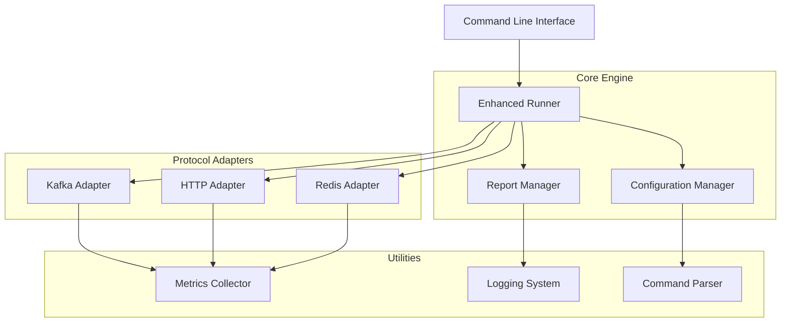

# Architecture Overview

## Introduction

redis-runner is a unified performance testing tool designed to benchmark Redis, HTTP, and Kafka protocols. The tool follows a modular architecture that allows for easy extension to support additional protocols in the future.

## Core Design Principles

1. **Unified Interface**: All protocols share a common command structure and configuration format
2. **Modular Architecture**: Each protocol is implemented as a separate adapter module
3. **Extensibility**: New protocols can be added with minimal changes to the core engine
4. **Performance**: High-performance concurrent testing with connection pooling
5. **Flexibility**: Support for various test scenarios and configurations

## System Architecture

## Key Components

### 1. Core Engine

The core engine is responsible for:
- Parsing command line arguments
- Managing configuration
- Coordinating test execution
- Collecting and reporting results

### 2. Protocol Adapters

Each protocol (Redis, HTTP, Kafka) has its own adapter that implements:
- Connection management
- Protocol-specific operations
- Metrics collection
- Error handling

### 3. Configuration Management

The configuration system supports:
- Command line arguments
- YAML configuration files
- Environment variables
- Default values

### 4. Reporting System

The reporting system provides:
- Real-time progress updates
- Detailed performance metrics
- Summary statistics
- Exportable test reports

## Data Flow

1. **Initialization**: CLI arguments are parsed and validated
2. **Configuration**: Settings are loaded from multiple sources
3. **Connection**: Protocol-specific connections are established
4. **Execution**: Test operations are executed concurrently
5. **Collection**: Metrics and results are collected
6. **Reporting**: Results are formatted and displayed

## Performance Considerations

- Connection pooling for efficient resource utilization
- Concurrent execution with goroutines
- Minimal memory allocation during tests
- Efficient data structures for metrics collection