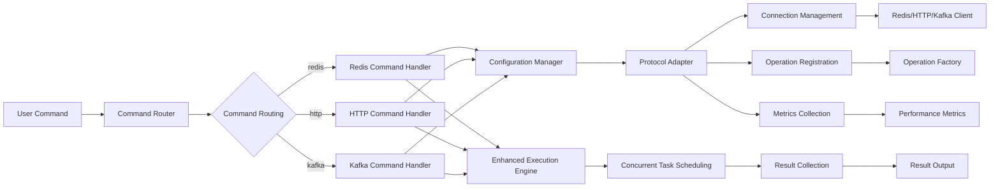
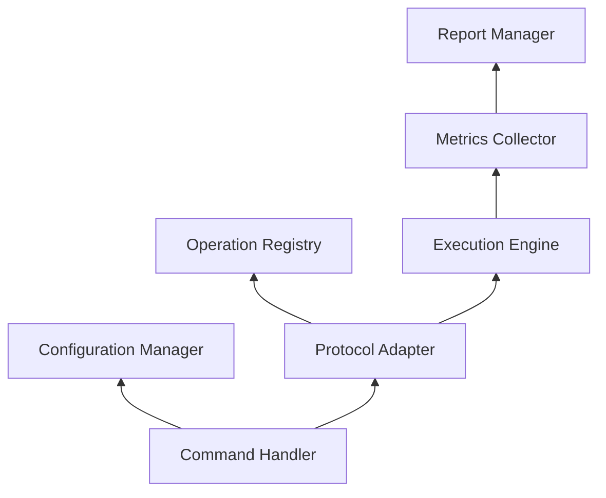

# Component Details

[English](components.md) | [中文](../zh/architecture/components.md)

## Core Components

### 1. Main Program (main.go)

The main program is the entry point of abc-runner, responsible for initializing the system and starting the command processing flow.

**Main Functions**:
- Initialize logging system
- Set up command router
- Parse command line arguments
- Execute corresponding commands

**Key Code Structure**:
```go
func main() {
    initLogging()
    initializeCommandSystem()
    executeCommand()
}
```

### 2. Command Router (SimpleCommandRouter)

The command router is responsible for routing user input commands to the appropriate handlers.

**Main Functions**:
- Command registration and management
- Alias resolution
- Command execution

**Interface Definition**:
```go
type CommandHandler interface {
    Execute(ctx context.Context, args []string) error
    GetHelp() string
}
```

### 3. Command Handlers

Each protocol has a corresponding command handler responsible for processing commands specific to that protocol.

#### Redis Command Handler
Located in `app/commands/redis.go`, handles Redis-related commands and parameters.

#### HTTP Command Handler
Located in `app/commands/http.go`, handles HTTP-related commands and parameters.

#### Kafka Command Handler
Located in `app/commands/kafka.go`, handles Kafka-related commands and parameters.

## Protocol Adapter Layer

### 1. Redis Adapter (app/adapters/redis)

The Redis adapter provides a unified interface for the Redis protocol.

**Main Components**:
- **Connection Management**: Manages Redis connection pool
- **Operation Execution**: Executes various Redis operations
- **Metrics Collection**: Collects performance metrics
- **Configuration Processing**: Handles Redis-specific configuration

**Key Interface**:
```go
type RedisAdapter struct {
    client redis.UniversalClient
    config *config.RedisConfig
    metrics *collector.MetricsCollector
}
```

### 2. HTTP Adapter (app/adapters/http)

The HTTP adapter provides a unified interface for the HTTP protocol.

**Main Components**:
- **Client Management**: Manages HTTP clients
- **Request Building**: Builds HTTP requests
- **Response Processing**: Processes HTTP responses
- **Connection Pool**: Manages HTTP connections

### 3. Kafka Adapter (app/adapters/kafka)

The Kafka adapter provides a unified interface for the Kafka protocol.

**Main Components**:
- **Producer Management**: Manages Kafka producers
- **Consumer Management**: Manages Kafka consumers
- **Message Processing**: Processes Kafka messages
- **Configuration Management**: Manages Kafka configuration

## Configuration Management Layer

### 1. Configuration Manager (app/core/config)

The configuration manager provides unified configuration loading and management functionality.

**Main Functions**:
- Multi-source configuration loading (command line, YAML, environment variables)
- Configuration priority handling
- Configuration validation
- Configuration hot reload (planned)

**Core Structure**:
```go
type ConfigManager struct {
    config interfaces.Config
    loader *MultiSourceLoader
}
```

### 2. Configuration Loader (app/core/config/multi_source_loader.go)

The multi-source configuration loader supports loading configuration from different sources.

**Supported Configuration Sources**:
- Command line arguments
- YAML configuration files
- Environment variables
- Default values

### 3. Protocol Configuration

Each protocol has corresponding configuration structures and loading logic.

#### Redis Configuration (app/adapters/redis/config)
```go
type RedisConfig struct {
    Mode      string         `yaml:"mode"`
    Benchmark BenchmarkConfig `yaml:"benchmark"`
    Pool      PoolConfig      `yaml:"pool"`
    // ...
}
```

#### HTTP Configuration (app/adapters/http/config)
```go
type HTTPConfig struct {
    Connection ConnectionConfig `yaml:"connection"`
    Requests   []RequestConfig  `yaml:"requests"`
    // ...
}
```

#### Kafka Configuration (app/adapters/kafka/config)
```go
type KafkaConfig struct {
    Brokers  []string        `yaml:"brokers"`
    Producer ProducerConfig  `yaml:"producer"`
    Consumer ConsumerConfig  `yaml:"consumer"`
    // ...
}
```

## Operation Management Layer

### 1. Operation Registry (app/core/utils/operation_registry.go)

The operation registry manages all available operation types.

**Main Functions**:
- Operation factory registration
- Operation instance creation
- Operation type management

**Interface Definition**:
```go
type OperationFactory interface {
    CreateOperation(params map[string]interface{}) (interfaces.Operation, error)
    GetOperationType() string
    ValidateParams(params map[string]interface{}) error
}
```

### 2. Operation Factories

Each operation type has a corresponding factory class responsible for creating operation instances.

#### Redis Operation Factories (app/adapters/redis/operations.go)
- StringGetOperationFactory
- StringSetOperationFactory
- SetGetRandomOperationFactory
- PublishOperationFactory
- etc...

#### HTTP Operation Factory (app/adapters/http/operations.go)
- HTTPOperationFactory

#### Kafka Operation Factory (app/adapters/kafka/operations.go)
- KafkaOperationFactory

## Execution Engine Layer

### 1. Enhanced Execution Engine (app/core/runner/enhanced_runner.go)

The execution engine is the core component that executes benchmark tests.

**Main Functions**:
- Concurrent task scheduling
- Load generation
- Result collection
- Performance monitoring

**Core Algorithm**:
```go
func (r *EnhancedRunner) RunBenchmark(ctx context.Context) (*interfaces.Metrics, error) {
    // 1. Initialize worker pool
    // 2. Start monitoring goroutine
    // 3. Execute test
    // 4. Collect results
    // 5. Calculate metrics
}
```

### 2. Concurrency Control

Efficient concurrency control is implemented using Go goroutines and channels.

**Worker Pool Implementation**:
```go
type WorkerPool struct {
    workers    int
    jobQueue   chan Job
    resultChan chan Result
    wg         sync.WaitGroup
}
```

## Metrics Collection Layer

### 1. Metrics Collector (app/core/interfaces/metrics.go)

Defines a unified metrics collection interface.

**Core Metrics**:
- RPS (Requests Per Second)
- Latency Distribution
- Error Rate
- Throughput

### 2. Protocol-Specific Metrics Collection

Each protocol has corresponding metrics collection implementations.

#### Redis Metrics Collection (app/adapters/redis/metrics)
- Connection pool status
- Command execution statistics
- Memory usage

#### HTTP Metrics Collection (app/adapters/http/metrics)
- Response status code distribution
- Connection reuse statistics
- Network latency

#### Kafka Metrics Collection (app/adapters/kafka/metrics)
- Producer metrics
- Consumer metrics
- Partition distribution

## Report Management Layer

### 1. Report Manager (app/core/reports/manager.go)

The report manager is responsible for generating and outputting test reports in various formats.

**Supported Report Formats**:
- Console output
- JSON format
- CSV format
- Text format

### 2. Report Generators

Each report format has a corresponding generator.

#### Console Report Generator
Provides detailed console output, including performance metrics and statistics.

#### JSON Report Generator
Generates structured JSON reports for programmatic parsing and processing.

#### CSV Report Generator
Generates CSV format reports for easy import into spreadsheet software for analysis.

## Utility Layer

### 1. Context Management (app/core/utils/context.go)

Provides unified context management functionality.

**Main Functions**:
- Timeout control
- Cancellation signals
- Context propagation

### 2. Parser (app/core/utils/parser.go)

Provides generic parameter parsing functionality.

**Supported Parsing Types**:
- Time duration
- Size
- Boolean

### 3. Statistics Tools (app/core/utils/statistics.go)

Provides statistical calculation functionality.

**Supported Statistical Calculations**:
- Average
- Percentiles
- Standard deviation
- Distribution statistics

## Error Handling Layer

### 1. Error Handler (app/core/error/handler.go)

Provides a unified error handling mechanism.

**Error Categories**:
- Configuration errors
- Connection errors
- Execution errors
- System errors

### 2. Error Wrapping

Use Go's error wrapping mechanism to preserve error context.

```go
return fmt.Errorf("failed to execute operation: %w", err)
```

## Testing Layer

### 1. Unit Tests

Each component has corresponding unit tests.

**Test Directory Structure**:
```
app/
├── adapters/
│   ├── redis/
│   │   └── test/
│   ├── http/
│   │   └── test/
│   └── kafka/
│       └── test/
└── core/
    └── utils/
        └── test/
```

### 2. Integration Tests

Provides integration tests to verify interactions between components.

### 3. Performance Tests

Provides benchmark tests to verify performance metrics.

## Component Interaction Relationships

### 1. Data Flow



### 2. Dependency Relationships



## Extension Points

### 1. Protocol Extension

Add new protocol support by implementing the ProtocolAdapter interface.

### 2. Operation Extension

Add new operation types by implementing the OperationFactory interface.

### 3. Report Extension

Add new report formats by implementing the ReportGenerator interface.

### 4. Metrics Extension

Add custom metrics collection by implementing the MetricsCollector interface.

## Best Practices

### 1. Interface Design

- Keep interfaces simple
- Follow the Single Responsibility Principle
- Provide reasonable default implementations

### 2. Error Handling

- Handle errors promptly
- Provide meaningful error messages
- Use error wrapping to preserve context

### 3. Concurrency Safety

- Use mutexes to protect shared resources
- Avoid data races
- Use channels for communication correctly

### 4. Performance Optimization

- Reuse objects to reduce GC pressure
- Use connection pools to reduce connection overhead
- Batch processing to improve throughput

### 5. Testability

- Dependency injection for easy mocking
- Interface isolation for unit testing
- Provide testing utilities