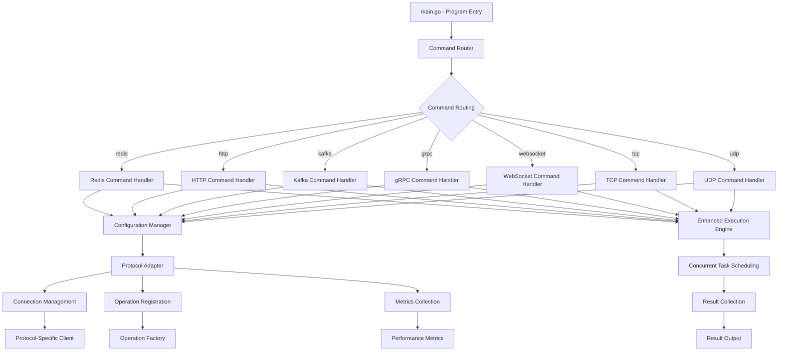
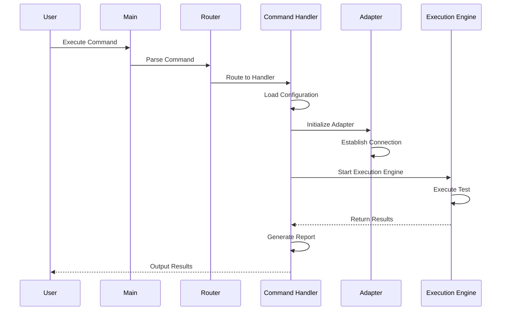
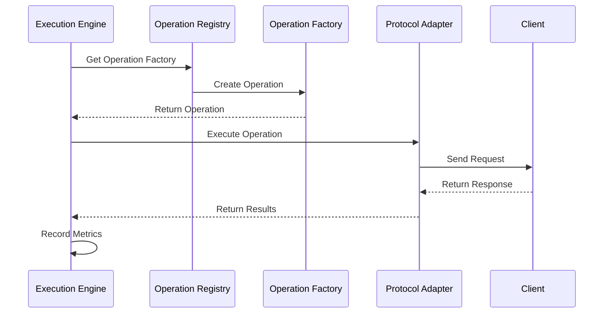

# Architecture Overview

[English](overview.md) | [中文](../zh/architecture/overview.md)

## System Architecture

abc-runner adopts a modular, layered architecture design with clear component boundaries and separation of responsibilities, supporting seven protocols: Redis, HTTP, Kafka, gRPC, WebSocket, TCP, and UDP.



## Core Components

### 1. Command Router

Responsible for parsing command line arguments and routing commands to the appropriate handlers.

**Main Responsibilities**:
- Parse global flags and subcommands
- Route commands to corresponding handlers
- Handle alias mapping
- Provide help information

### 2. Command Handlers

Each protocol has a dedicated command handler responsible for processing commands specific to that protocol.

**Main Responsibilities**:
- Parse protocol-specific command line arguments
- Load and validate configuration
- Initialize protocol adapters
- Execute benchmark tests
- Generate reports

### 3. Configuration Manager

Unified management of configuration loading, validation, and access for all protocols.

**Main Responsibilities**:
- Support multiple configuration sources (command line, YAML, environment variables)
- Configuration priority management
- Configuration validation
- Configuration hot reload (future support)

### 4. Protocol Adapters

Provide a unified interface for different protocols, shielding protocol differences.

**Main Responsibilities**:
- Connection management
- Operation execution
- Metrics collection
- Resource cleanup

### 5. Operation Registry

Manages all available operation types and their factories.

**Main Responsibilities**:
- Operation type registration
- Operation instance creation
- Parameter validation

### 6. Runner Engine

The core engine that executes benchmark tests.

**Main Responsibilities**:
- Concurrent task scheduling
- Load generation
- Result collection
- Performance monitoring

### 7. Report Manager

Generates and outputs test reports.

**Main Responsibilities**:
- Multi-format report generation
- Metrics calculation and analysis
- Report persistence
- Result visualization

## Data Flow

### 1. Startup Process



### 2. Test Execution Flow



## Design Principles

### 1. Single Responsibility Principle

Each component has a clear responsibility, avoiding functional overlap.

### 2. Open/Closed Principle

Support extension without modifying core code through interfaces and plugin architecture.

### 3. Dependency Inversion Principle

High-level modules don't depend on low-level modules, both depend on abstractions.

### 4. Interface Segregation Principle

Provide fine-grained interfaces, avoiding bulky interfaces.

### 5. Law of Demeter

Reduce coupling between components, only communicate with direct friends.

## Concurrency Model

### 1. Worker Pool Pattern

Use a fixed-size worker pool to execute concurrent tests:

```go
// Pseudo code example
type WorkerPool struct {
    workers    int
    jobQueue   chan Job
    resultChan chan Result
}
```

### 2. Goroutine Scheduling

Use Go goroutines for lightweight concurrent scheduling:

```go
// Pseudo code example
for i := 0; i < parallels; i++ {
    go worker(workChan, resultChan)
}
```

### 3. Channel Communication

Use channels for inter-goroutine communication and synchronization:

```go
// Pseudo code example
type Job struct {
    Operation interfaces.Operation
    Context   context.Context
}

type Result struct {
    Latency time.Duration
    Error   error
}
```

## Error Handling

### 1. Layered Error Handling

Different layers adopt different error handling strategies:

- **Adapter Layer**: Protocol-specific error handling
- **Execution Engine Layer**: General error handling and retry
- **Command Handler Layer**: User-friendly error information
- **Main Program Layer**: System-level error handling

### 2. Error Wrapping

Use error wrapping to preserve error context:

```go
return fmt.Errorf("failed to connect to Redis: %w", err)
```

### 3. Error Classification

Classify errors for different handling:

- **Temporary Errors**: Retriable errors
- **Permanent Errors**: Non-retriable errors
- **Configuration Errors**: User configuration errors
- **System Errors**: System resource errors

## Performance Optimization

### 1. Connection Pool

Use connection pools to reduce connection establishment overhead:

```go
type ConnectionPool struct {
    connections chan *Connection
    factory     func() (*Connection, error)
}
```

### 2. Object Reuse

Reuse operation objects to reduce GC pressure:

```go
type OperationPool struct {
    pool sync.Pool
}
```

### 3. Batch Processing

Support batch operations to improve throughput:

```go
type BatchOperation struct {
    Operations []interfaces.Operation
}
```

## Extensibility

### 1. Plugin Architecture

Define contracts through interfaces to support plugin extensions:

```go
type ProtocolAdapter interface {
    Connect(ctx context.Context, config interfaces.Config) error
    ExecuteOperation(ctx context.Context, op interfaces.Operation) (interface{}, error)
    // ...
}
```

### 2. Configuration Driven

Drive behavior through configuration files to reduce code modification:

```yaml
redis:
  mode: "cluster"
  operations:
    - type: "custom_operation"
      weight: 50
```

### 3. Hook Mechanism

Provide hook mechanisms to support custom logic:

```go
type Hook interface {
    BeforeOperation(op interfaces.Operation) error
    AfterOperation(op interfaces.Operation, result interface{}, err error) error
}
```

## Monitoring and Metrics

### 1. Built-in Metrics

Collect key performance metrics:

- RPS (Requests Per Second)
- Latency Distribution
- Error Rate
- Throughput

### 2. Custom Metrics

Support custom metrics collection:

```go
type CustomMetricsCollector struct {
    metrics map[string]float64
}
```

### 3. External Integration

Support integration with external monitoring systems:

- Prometheus
- Grafana
- StatsD
- OpenTelemetry

## Security

### 1. Configuration Security

Handle sensitive information through environment variables or secret management:

```yaml
redis:
  password: "${REDIS_PASSWORD}"  # Read from environment variables
```

### 2. Connection Security

Support TLS encrypted connections:

```go
tlsConfig := &tls.Config{
    InsecureSkipVerify: false,
    // ...
}
```

### 3. Access Control

Support authentication and authorization mechanisms:

```go
type AuthConfig struct {
    Type     string `yaml:"type"`
    Username string `yaml:"username"`
    Password string `yaml:"password"`
}
```