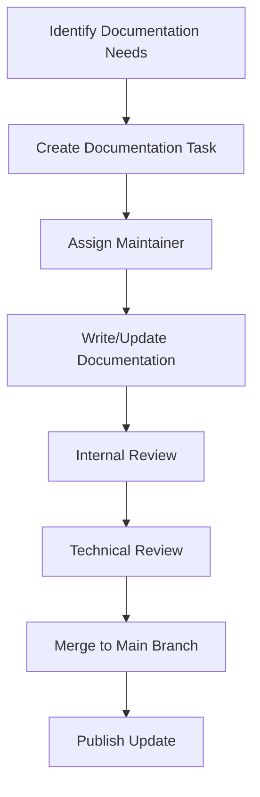

# Documentation Maintenance Guide

[English](documentation.md) | [中文](documentation.zh.md)

## Documentation Maintenance Process

### 1. Documentation Update Cycle

- **Daily Maintenance**: Synchronize documentation updates with code changes
- **Release**: Conduct comprehensive documentation review before each release
- **Periodic Review**: Perform quarterly comprehensive documentation reviews

### 2. Documentation Update Process



### 3. Documentation Version Management

- Keep documentation synchronized with code versions
- Major changes require version tagging
- Provide access to historical documentation versions

## Documentation Structure Maintenance

### 1. Directory Structure Standards

```
docs/
├── getting-started/     # Quick Start Guide
├── user-guide/          # User Manual
├── developer-guide/     # Developer Guide
├── architecture/        # Architecture Design Documents
├── configuration/       # Configuration Management Documents
├── deployment/          # Deployment and Operations Documents
├── changelog/           # Change Logs
├── faq/                 # Frequently Asked Questions
└── maintenance/         # Maintenance Guides
```

### 2. File Naming Standards

- Use lowercase letters and hyphens
- Avoid special characters and spaces
- Keep names concise and clear

### 3. Documentation Format Standards

- Use standard Markdown syntax
- Maintain consistent heading levels
- Use appropriate code blocks and examples
- Add necessary links and references

## Content Maintenance Standards

### 1. Accuracy

- Ensure all information is consistent with the current version
- Regularly verify the correctness of code examples
- Update outdated information in a timely manner

### 2. Completeness

- Cover all major features and functionalities
- Provide necessary background information
- Include common questions and solutions

### 3. Readability

- Use clear and concise language
- Maintain logical structure
- Provide appropriate diagrams and examples

### 4. Consistency

- Unify terminology and expressions
- Maintain consistent format and style
- Follow documentation structure standards

## Maintenance Tools

### 1. Documentation Generation Tools

Use tools to automatically generate part of the documentation content:

```makefile
# Generate API documentation
.PHONY: docs-api
docs-api:
	@echo "Generating API documentation..."
	@godoc -http=:6060 &

# Generate configuration documentation
.PHONY: docs-config
docs-config:
	@echo "Generating configuration documentation..."
	@go run tools/generate_config_docs.go
```

### 2. Documentation Validation Tools

```bash
# Check link validity
make docs-check-links

# Check syntax and format
make docs-lint
```

### 3. Automated Checks

Integrate documentation checks in CI/CD pipeline:

```yaml
# .github/workflows/docs.yml
name: Documentation Check
on: [push, pull_request]
jobs:
  docs-check:
    runs-on: ubuntu-latest
    steps:
    - uses: actions/checkout@v3
    - name: Check markdown links
      run: |
        npm install -g markdown-link-check
        find docs -name "*.md" -exec markdown-link-check {} \;
    - name: Lint markdown files
      run: |
        npm install -g markdownlint-cli
        markdownlint docs/**/*.md
```

## Contributor Guide

### 1. Documentation Contribution Process

1. **Fork Repository**
2. **Create Branch**
   ```bash
   git checkout -b docs/feature-name
   ```
3. **Write Documentation**
4. **Commit Changes**
   ```bash
   git add .
   git commit -m "docs: add feature documentation"
   ```
5. **Push Branch**
   ```bash
   git push origin docs/feature-name
   ```
6. **Create Pull Request**

### 2. Documentation Writing Standards

#### Heading Standards

```markdown
# Level 1 Heading (Page Title)
## Level 2 Heading (Main Section)
### Level 3 Heading (Subsection)
#### Level 4 Heading (Subsection)
```

#### Code Examples

````markdown
```bash
# Command example
abc-runner redis -h localhost -p 6379
```

```go
// Go code example
func main() {
    fmt.Println("Hello, abc-runner!")
}
```

```yaml
# Configuration example
redis:
  mode: "standalone"
```
````

#### Link Standards

```markdown
[Internal Link](../user-guide/redis.md)
[External Link](https://redis.io)
[API Documentation](../../api/#function-name)
```

### 3. Review Standards

#### Technical Accuracy
- All technical information must be accurate
- Code examples must be runnable
- Configuration examples must be valid

#### Language Quality
- Use standard English expressions
- Avoid grammar errors
- Maintain consistent professional terminology

#### Structural Integrity
- Follow documentation structure standards
- Maintain clear logic
- Provide necessary context

## Change Management

### 1. Change Log

Maintain detailed documentation change logs:

```markdown
## [1.2.0] - 2025-09-08

### 🚀 Added

- Add Kubernetes deployment guide
- Add Docker deployment documentation

### 🛠️ Improved

- Optimize Redis configuration documentation
- Update HTTP testing guide

### 📝 Fixed

- Correct errors in configuration examples
- Fix broken links
```

### 2. Version Tagging

Add version information in documentation:

```markdown
> Applicable to version v0.2.0+
```

### 3. Deprecation Notices

Mark deprecated features and documentation:

```markdown
> ⚠️ This feature has been deprecated in version v0.2.0. Please use the new feature instead.
```

## Quality Assurance

### 1. Periodic Reviews

- **Monthly Quick Review**: Check accuracy of new content
- **Quarterly Comprehensive Review**: Thoroughly check all documentation
- **Annual Restructuring**: Restructure and optimize documentation structure

### 2. User Feedback

- Collect user feedback on documentation
- Improve documentation quality based on feedback
- Establish documentation improvement task tracking

### 3. Test Coverage

- Ensure code examples are runnable
- Verify configuration example validity
- Test command example correctness

## Best Practices

### 1. Content Organization

- Organize documentation by user roles
- Provide quick start guides
- Build a complete knowledge system

### 2. Search Optimization

- Use descriptive headings
- Add keyword tags
- Provide search functionality

### 3. Multilingual Support

- Plan multilingual documentation structure
- Establish translation process
- Maintain language version synchronization

### 4. Accessibility

- Ensure documentation accessibility
- Provide multiple output formats
- Support screen readers

## Templates and Examples

### 1. Documentation Template

```markdown
# Document Title

## Overview

Brief introduction to document content and target audience.

## Table of Contents

- [Section 1](#section-1)
- [Section 2](#section-2)

## Section 1

Detailed content...

## Section 2

Detailed content...

## Related Resources

- [Link 1](url1)
- [Link 2](url2)
```

### 2. API Documentation Template

```markdown
## Function Name

### Description

Function functionality description.

### Parameters

| Parameter Name | Type | Required | Description |
|----------------|------|----------|-------------|
| param1 | string | Yes | Parameter description |

### Return Value

Return value description.

### Example

```go
// Usage example
result := function(param1)
```
```

### 3. Configuration Documentation Template

```markdown
## Configuration Item Name

### Description

Configuration item functionality description.

### Type

Data type

### Default Value

Default value

### Example

```yaml
config_item: value
```

### Notes

Usage notes.
```

## Maintenance Team

### 1. Role Definitions

- **Documentation Lead**: Responsible for overall documentation strategy and quality
- **Technical Author**: Responsible for technical content writing
- **Editor**: Responsible for language polishing and format standards
- **Reviewer**: Responsible for content accuracy and completeness review

### 2. Collaboration Process

- Use project management tools to track tasks
- Hold regular documentation maintenance meetings
- Establish documentation contributor community

### 3. Training and Support

- Provide documentation writing training
- Build documentation maintenance knowledge base
- Provide technical support and guidance