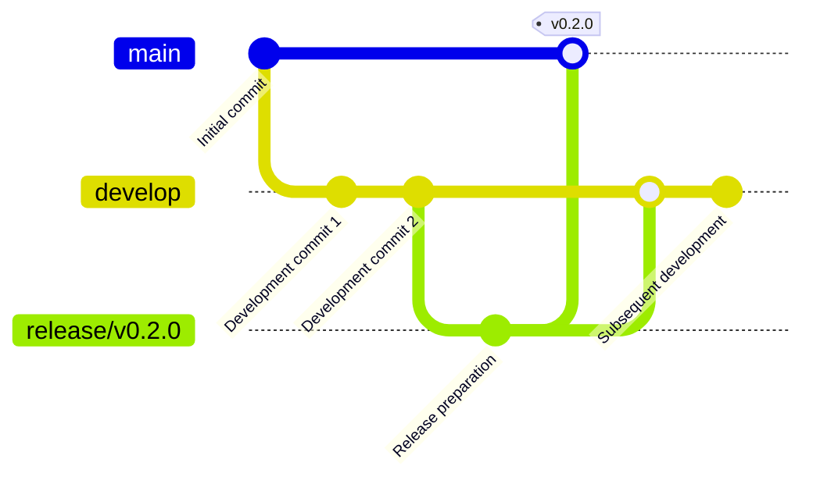

# Release Guide

[English](release.md) | [中文](release.zh.md)

## Release Process

### 1. Release Preparation

#### Checklist

- [ ] All features completed and tested
- [ ] Documentation updated and reviewed
- [ ] CHANGELOG.md updated
- [ ] Version number updated
- [ ] All CI/CD checks passed
- [ ] Release notes prepared

#### Version Number Management

Follow [Semantic Versioning](https://semver.org/) specification:

- **Major version**: Incompatible API changes
- **Minor version**: Backward compatible feature additions
- **Patch version**: Backward compatible bug fixes

### 2. Release Branch

```bash
# Create release branch
git checkout -b release/v0.2.0 develop

# Update version number
echo "0.2.0" > VERSION

# Update CHANGELOG
# Edit docs/changelog/CHANGELOG-v0.2.0.md

# Commit changes
git add .
git commit -m "chore: prepare release v0.2.0"
```

### 3. Final Testing

```bash
# Run all tests
make test
make integration-test

# Build binaries for all platforms
make build-all

# Verify binaries
./bin/redis-runner-*
```

### 4. Merge to Main Branch

```bash
# Switch to main branch
git checkout main

# Merge release branch
git merge release/v0.2.0

# Create tag
git tag -a v0.2.0 -m "Release version 0.2.0"

# Push changes
git push origin main
git push origin v0.2.0
```

### 5. Release to GitHub

#### Create GitHub Release

1. Visit GitHub Releases page
2. Click "Draft a new release"
3. Select tag version
4. Fill in release title and description
5. Upload pre-compiled binaries
6. Publish Release

#### Upload Assets

```bash
# Upload pre-compiled binaries
gh release create v0.2.0 \
  bin/redis-runner-darwin-amd64 \
  bin/redis-runner-darwin-arm64 \
  bin/redis-runner-linux-amd64 \
  bin/redis-runner-linux-arm64 \
  bin/redis-runner-windows-amd64.exe \
  --title "v0.2.0" \
  --notes "Release notes for v0.2.0"
```

### 6. Publish Docker Image

```bash
# Build Docker image
docker build -t redis-runner/redis-runner:v0.2.0 .

# Push image
docker push redis-runner/redis-runner:v0.2.0
docker tag redis-runner/redis-runner:v0.2.0 redis-runner/redis-runner:latest
docker push redis-runner/redis-runner:latest
```

### 7. Update Documentation Website

```bash
# Build documentation
make docs

# Deploy to GitHub Pages
# or other documentation hosting service
```

### 8. Notify Community

- Send email to mailing list
- Post updates on social media
- Update project website
- Notify important users

## Version Branching Strategy

### GitFlow Workflow



### Branch Naming Convention

- **main**: Stable version branch
- **develop**: Development branch
- **feature/***: Feature development branches
- **hotfix/***: Emergency fix branches
- **release/***: Release preparation branches

## CHANGELOG Management

### Format Specification

```markdown
## [Version] - Release Date

### 🚀 Added

- New feature description

### 🛠️ Improved

- Improvement description

### 🐛 Fixed

- Fixed issue description

### 💥 Breaking Changes

- Breaking change description

### 🔒 Security

- Security-related updates
```

### Auto Generation

Use tools to automatically generate CHANGELOG:

```bash
# Using github-changelog-generator
github_changelog_generator \
  --user your-org \
  --project redis-runner \
  --token $GITHUB_TOKEN \
  --since-tag v0.1.0 \
  --future-release v0.2.0
```

## Quality Assurance

### 1. Test Coverage

Ensure test coverage meets requirements before release:

- Unit test coverage: ≥ 80%
- Integration test pass rate: 100%
- Performance test baseline: Meets expectations

### 2. Code Review

All code must pass review before merging:

- At least one core maintainer review
- All review comments must be addressed
- Can only be merged after approval

### 3. Security Check

```bash
# Run security scan
gosec ./...

# Check dependency security
govulncheck ./...
```

## Post-Release Tasks

### 1. Monitoring

- Monitor GitHub Issues
- Monitor community feedback
- Monitor downloads and usage

### 2. Support

- Respond to user questions promptly
- Fix discovered issues
- Update documentation and examples

### 3. Planning

- Collect user requirements
- Plan next version
- Update roadmap

## Emergency Fixes

### Hotfix Process

```bash
# Create hotfix branch from main
git checkout -b hotfix/critical-bug main

# Fix issue and commit
git commit -am "fix: critical bug fix"

# Merge to main and tag
git checkout main
git merge hotfix/critical-bug
git tag -a v0.2.1 -m "Hotfix release v0.2.1"

# Merge to develop branch
git checkout develop
git merge hotfix/critical-bug

# Delete hotfix branch
git branch -d hotfix/critical-bug
```

### Release Emergency Fix

```bash
# Build and release emergency fix version
make build-all
gh release create v0.2.1 \
  bin/redis-runner-* \
  --title "v0.2.1" \
  --notes "Emergency fix version"
```

## Automated Release

### GitHub Actions

```yaml
# .github/workflows/release.yml
name: Release
on:
  push:
    tags:
      - 'v*'
jobs:
  release:
    runs-on: ubuntu-latest
    steps:
    - uses: actions/checkout@v3
    - name: Setup Go
      uses: actions/setup-go@v4
      with:
        go-version: 1.25.x
    - name: Build binaries
      run: make build-all
    - name: Create Release
      uses: softprops/action-gh-release@v1
      with:
        files: bin/redis-runner-*
        body_path: CHANGELOG.md
      env:
        GITHUB_TOKEN: ${{ secrets.GITHUB_TOKEN }}
```

### Docker Auto Build

```yaml
# .github/workflows/docker.yml
name: Docker
on:
  push:
    tags:
      - 'v*'
jobs:
  docker:
    runs-on: ubuntu-latest
    steps:
    - uses: actions/checkout@v3
    - name: Set up Docker Buildx
      uses: docker/setup-buildx-action@v2
    - name: Login to DockerHub
      uses: docker/login-action@v2
      with:
        username: ${{ secrets.DOCKER_USERNAME }}
        password: ${{ secrets.DOCKER_PASSWORD }}
    - name: Build and push
      uses: docker/build-push-action@v4
      with:
        context: .
        push: true
        tags: redis-runner/redis-runner:${{ github.ref_name }},redis-runner/redis-runner:latest
```

## Release Checklist

### Pre-Release Check

- [ ] Code completed and passed all tests
- [ ] Documentation updated and reviewed
- [ ] CHANGELOG updated
- [ ] Version number updated
- [ ] All CI/CD checks passed
- [ ] Release notes prepared
- [ ] Pre-compiled binaries built
- [ ] Docker image built

### Release Check

- [ ] Code merged to main branch
- [ ] Git tag created and pushed
- [ ] GitHub Release created
- [ ] Binaries uploaded
- [ ] Docker image pushed
- [ ] Documentation website updated
- [ ] Community notified

### Post-Release Check

- [ ] User feedback monitoring set up
- [ ] Download statistics monitoring set up
- [ ] Issue tracking prepared
- [ ] Next version planning started

## Common Issues

### 1. What if release fails?

1. Identify failure cause
2. Fix the issue
3. Re-tag (if necessary)
4. Re-execute release process

### 2. How to rollback release?

1. Delete GitHub Release
2. Delete Git tag
3. Notify users
4. Fix issue and re-release

### 3. How to handle emergency security issues?

1. Immediately create hotfix branch
2. Fix security issue
3. Quick review and testing
4. Immediately release emergency fix version
5. Notify affected users