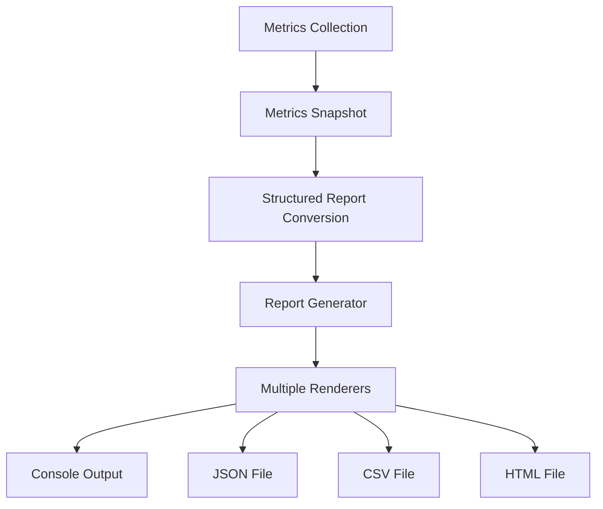

# Performance Testing Report System Guide

[English](reporting.md) | [中文](../zh/user-guide/reporting.md)

## Overview

The abc-runner reporting system provides comprehensive performance analysis and visualization capabilities. It transforms raw metrics data into structured reports across multiple formats, offering deep insights into system performance, bottlenecks, and optimization opportunities.

## Report Architecture

### Core Components



### Report Structure

Each performance report contains four main sections:

1. **Executive Dashboard** - High-level performance summary
2. **Metrics Breakdown** - Detailed performance analysis
3. **System Health** - Resource utilization and runtime metrics
4. **Context Metadata** - Test configuration and environment

## Report Formats

### 1. Console Output

Real-time console reporting with formatted output and visual indicators.

**Features:**
- Color-coded status indicators
- Performance score visualization
- Key metrics summary
- Actionable insights and recommendations

**Example:**
```bash
# Basic console report (default)
./abc-runner redis -h localhost -p 6379 -n 10000 -c 50

# Console report with extended metrics
./abc-runner http --url http://api.example.com -n 5000 -c 25 --verbose
```

**Sample Console Output:**
```
================================================================================
             ABC-RUNNER 性能测试报告
================================================================================

📊 执行摘要
----------------------------------------
性能评分: 87/100
系统状态: 🟢 良好
协议类型: redis
测试时长: 30.5s

⚡ 核心性能指标
----------------------------------------
总操作数: 10000
成功操作: 9987 (99.87%)
失败操作: 13 (0.13%)
吞吐量: 327.87 ops/sec

🚀 延迟分析
----------------------------------------
平均延迟: 2.45ms
最小延迟: 0.12ms
最大延迟: 45.67ms
延迟百分位:
  P50: 1.89ms
  P90: 4.23ms
  P95: 6.78ms
  P99: 12.34ms

💻 系统健康状态
----------------------------------------
内存使用: 2.34%
活跃协程: 52
GC次数: 15

💡 关键洞察
----------------------------------------
• 高吞吐量性能: 系统展现出优秀的吞吐量表现
• 延迟稳定性: P99延迟保持在可接受范围内

🔧 优化建议
----------------------------------------
• [HIGH] Connection Pool: 增加连接池大小以提升并发能力
• [MEDIUM] Memory Management: 优化内存分配模式
```

### 2. JSON Reports

Machine-readable structured data format ideal for integration and further analysis.

**Features:**
- Complete metrics data preservation
- API integration friendly
- Programmatic processing support
- Time-series analysis compatibility

**Configuration:**
```yaml
reports:
  enabled: true
  formats: ["json"]
  output_dir: "./reports"
  file_prefix: "benchmark"
  include_timestamp: true
```

**Generate JSON Reports:**
```bash
# Single protocol JSON report
./abc-runner redis --config config/redis.yaml --output-format json

# Multiple protocols with JSON reports
./abc-runner http --url http://api.example.com -n 1000 --output-format json,console

# JSON report with custom output directory
./abc-runner kafka --broker localhost:9092 --topic test \
  --output-format json \
  --output-dir ./custom_reports \
  --file-prefix kafka_performance
```

**Sample JSON Structure:**
```json
{
  "dashboard": {
    "performance_score": 87,
    "status_indicator": "good",
    "key_insights": [
      {
        "type": "performance",
        "title": "高吞吐量性能",
        "description": "系统展现出优秀的吞吐量表现",
        "impact": "high"
      }
    ],
    "recommendations": [
      {
        "category": "Connection Pool",
        "action": "增加连接池大小以提升并发能力",
        "priority": "high"
      }
    ]
  },
  "metrics": {
    "core_operations": {
      "total_operations": 10000,
      "successful_ops": 9987,
      "failed_ops": 13,
      "success_rate": 99.87,
      "error_rate": 0.13,
      "operations_per_second": 327.87
    },
    "latency_analysis": {
      "average_latency": "2.45ms",
      "percentiles": {
        "p50": "1.89ms",
        "p90": "4.23ms",
        "p95": "6.78ms",
        "p99": "12.34ms"
      }
    }
  }
}
```

### 3. CSV Reports

Tabular data format perfect for spreadsheet analysis and data visualization tools.

**Features:**
- Excel/Google Sheets compatibility
- Time-series trend analysis
- Statistical processing
- Database import support

**Generate CSV Reports:**
```bash
# Basic CSV report
./abc-runner websocket --url ws://localhost:8080/ws -n 1000 --output-format csv

# CSV with custom fields
./abc-runner tcp --host localhost --port 8080 -n 2000 \
  --output-format csv \
  --csv-fields timestamp,protocol,rps,avg_latency,p99_latency

# Batch CSV generation for multiple tests
for protocol in redis http kafka; do
  ./abc-runner $protocol --config config/${protocol}.yaml \
    --output-format csv \
    --file-prefix ${protocol}_batch_$(date +%Y%m%d)
done
```

**CSV Fields:**
- `timestamp` - Test execution time
- `protocol` - Protocol type (redis, http, kafka, etc.)
- `performance_score` - Overall performance score (0-100)
- `status` - System status (good, warning, critical)
- `total_ops` - Total operations executed
- `success_rate` - Operation success percentage
- `rps` - Requests/operations per second
- `avg_latency_ms` - Average latency in milliseconds
- `p90_latency_ms` - 90th percentile latency
- `p95_latency_ms` - 95th percentile latency
- `p99_latency_ms` - 99th percentile latency
- `memory_usage_percent` - Memory utilization percentage
- `active_goroutines` - Number of active goroutines

### 4. HTML Reports

Rich visual reports with interactive elements and professional presentation.

**Features:**
- Professional visual design
- Color-coded status indicators
- Responsive layout
- Printable format
- Embed-ready for documentation

**Generate HTML Reports:**
```bash
# Basic HTML report
./abc-runner grpc --target localhost:9090 -n 1000 --output-format html

# HTML report with custom styling
./abc-runner udp --host localhost --port 8080 -n 500 \
  --output-format html \
  --html-theme professional \
  --include-charts

# Comprehensive HTML report with all sections
./abc-runner redis -h localhost -p 6379 -n 10000 -c 100 \
  --output-format html \
  --html-sections dashboard,metrics,system,insights,recommendations
```

**HTML Report Features:**
- Executive dashboard with key metrics
- Interactive performance charts
- Detailed latency analysis graphs
- System health indicators
- Actionable recommendations
- Mobile-responsive design

## Report Configuration

### Global Configuration

Configure reporting behavior in your main configuration file:

```yaml
# config/core.yaml
reporting:
  # Enable/disable reporting system
  enabled: true
  
  # Default output formats
  formats: ["console", "json", "csv", "html"]
  
  # Output directory for file reports
  output_dir: "./reports"
  
  # File naming configuration
  file_prefix: "performance"
  include_timestamp: true
  
  # Report content configuration
  include_system_metrics: true
  include_insights: true
  include_recommendations: true
  
  # Performance thresholds
  thresholds:
    error_rate_warning: 5.0    # 5% error rate warning
    error_rate_critical: 10.0  # 10% error rate critical
    latency_warning_ms: 500    # 500ms latency warning
    latency_critical_ms: 1000  # 1000ms latency critical
```

### Protocol-Specific Configuration

Each protocol can have customized reporting settings:

```yaml
# config/redis.yaml
reporting:
  formats: ["console", "json"]
  file_prefix: "redis_benchmark"
  
  # Redis-specific metrics
  include_redis_info: true
  include_memory_analysis: true
  include_slowlog: true

# config/http.yaml  
reporting:
  formats: ["console", "html"]
  file_prefix: "http_loadtest"
  
  # HTTP-specific metrics
  include_response_codes: true
  include_header_analysis: true
  include_body_size_stats: true

# config/kafka.yaml
reporting:
  formats: ["console", "csv"]
  file_prefix: "kafka_performance"
  
  # Kafka-specific metrics
  include_partition_metrics: true
  include_consumer_lag: true
  include_broker_stats: true
```

### Command-Line Configuration

Override configuration settings directly from command line:

```bash
# Override output formats
./abc-runner redis -h localhost -p 6379 -n 1000 \
  --report-formats console,json,html

# Custom output directory
./abc-runner http --url http://api.example.com -n 2000 \
  --report-dir ./custom_reports \
  --report-prefix api_test

# Disable specific report sections
./abc-runner websocket --url ws://localhost:8080/ws -n 1000 \
  --no-insights \
  --no-recommendations \
  --minimal-report

# Configure performance thresholds
./abc-runner tcp --host localhost --port 8080 -n 1000 \
  --error-threshold 2.0 \
  --latency-threshold 100 \
  --memory-threshold 80
```

## Advanced Reporting Features

### 1. Performance Scoring

The system calculates a comprehensive performance score (0-100) based on:

- **Success Rate (40%)** - Operation success percentage
- **Latency Performance (30%)** - Response time metrics
- **Throughput Performance (30%)** - Operations per second

**Scoring Algorithm:**
```
Base Score = Success Rate * 0.4

Latency Bonus:
- < 10ms: +30 points
- < 50ms: +20 points  
- < 100ms: +10 points

Throughput Bonus:
- > 1000 ops/sec: +30 points
- > 500 ops/sec: +20 points
- > 100 ops/sec: +10 points

Final Score = min(Base Score + Bonuses, 100)
```

### 2. Status Indicators

Three-tier status system:

- **🟢 Good** - Error rate < 5%, Average latency < 500ms
- **🟡 Warning** - Error rate 5-10%, Average latency 500-1000ms  
- **🔴 Critical** - Error rate > 10%, Average latency > 1000ms

### 3. Key Insights Generation

Automated insights based on performance patterns:

**Performance Insights:**
- High throughput performance detection
- Latency stability analysis
- Error pattern recognition
- Resource utilization assessment

**Reliability Insights:**
- Connection stability analysis
- Error rate trend identification
- Timeout pattern detection

**Efficiency Insights:**
- Resource optimization opportunities
- Scalability bottleneck identification
- Configuration tuning suggestions

### 4. Optimization Recommendations

Actionable recommendations with priority levels:

**Priority Levels:**
- **HIGH** - Critical performance impact
- **MEDIUM** - Moderate performance improvement
- **LOW** - Minor optimization opportunity

**Recommendation Categories:**
- Connection Pool Management
- Memory Optimization
- Configuration Tuning
- Monitoring Setup
- Infrastructure Scaling

## Report Integration

### 1. CI/CD Integration

Integrate reports into your continuous integration pipeline:

```bash
#!/bin/bash
# ci/performance-test.sh

# Run performance tests with JSON output
./abc-runner redis --config ci/redis-test.yaml \
  --output-format json \
  --output-dir ./test-results \
  --file-prefix ci-redis-$(date +%Y%m%d-%H%M%S)

# Parse results and fail if performance degrades
python ci/parse-performance.py ./test-results/ci-redis-*.json

# Upload reports to artifact storage
aws s3 cp ./test-results/ s3://performance-reports/$(date +%Y/%m/%d)/ --recursive
```

### 2. Monitoring Integration

Send metrics to monitoring systems:

```bash
# Send metrics to Prometheus pushgateway
./abc-runner kafka --broker localhost:9092 --topic perf-test -n 10000 \
  --prometheus-gateway http://pushgateway:9091 \
  --job-name kafka-performance

# Export to InfluxDB
./abc-runner http --url http://api.example.com -n 5000 \
  --influxdb-url http://influxdb:8086 \
  --influxdb-database performance \
  --influxdb-measurement http_test
```

### 3. Dashboard Integration

Create performance dashboards:

```javascript
// Grafana dashboard query example
SELECT 
  mean("rps") as "Average RPS",
  mean("p99_latency_ms") as "P99 Latency",
  mean("error_rate") as "Error Rate"
FROM "http_test" 
WHERE time >= now() - 24h 
GROUP BY time(1h)
```

## Report Analysis Examples

### 1. Performance Trend Analysis

```bash
# Generate daily performance reports
for day in {1..7}; do
  date_suffix=$(date -d "$day days ago" +%Y%m%d)
  ./abc-runner redis -h localhost -p 6379 -n 10000 \
    --output-format csv \
    --file-prefix daily_redis_$date_suffix
done

# Analyze trends
python analysis/trend_analysis.py ./reports/daily_redis_*.csv
```

### 2. A/B Performance Testing

```bash
# Test configuration A
./abc-runner http --url http://api-v1.example.com -n 5000 \
  --output-format json \
  --file-prefix config_a_test

# Test configuration B  
./abc-runner http --url http://api-v2.example.com -n 5000 \
  --output-format json \
  --file-prefix config_b_test

# Compare results
python analysis/ab_compare.py config_a_test.json config_b_test.json
```

### 3. Load Profile Analysis

```bash
# Light load test
./abc-runner websocket --url ws://localhost:8080/ws -n 1000 -c 10 \
  --output-format csv --file-prefix light_load

# Medium load test
./abc-runner websocket --url ws://localhost:8080/ws -n 5000 -c 50 \
  --output-format csv --file-prefix medium_load

# Heavy load test
./abc-runner websocket --url ws://localhost:8080/ws -n 10000 -c 100 \
  --output-format csv --file-prefix heavy_load

# Analyze load profile
python analysis/load_profile.py light_load.csv medium_load.csv heavy_load.csv
```

## Custom Report Development

### 1. Custom Renderer Implementation

Create custom report formats:

```go
// custom_renderer.go
package reporting

import (
    "bytes"
    "fmt"
)

type XMLRenderer struct{}

func NewXMLRenderer() *XMLRenderer {
    return &XMLRenderer{}
}

func (x *XMLRenderer) Format() string {
    return "xml"
}

func (x *XMLRenderer) Extension() string {
    return "xml"
}

func (x *XMLRenderer) Render(report *StructuredReport) ([]byte, error) {
    var buf bytes.Buffer
    
    buf.WriteString("<?xml version=\"1.0\" encoding=\"UTF-8\"?>\n")
    buf.WriteString("<performance_report>\n")
    buf.WriteString(fmt.Sprintf("  <score>%d</score>\n", report.Dashboard.PerformanceScore))
    buf.WriteString(fmt.Sprintf("  <status>%s</status>\n", report.Dashboard.StatusIndicator))
    // ... more XML generation
    buf.WriteString("</performance_report>\n")
    
    return buf.Bytes(), nil
}
```

### 2. Register Custom Renderer

```go
// Register the custom renderer
generator := reporting.NewReportGenerator(config)
generator.RegisterRenderer("xml", NewXMLRenderer())
```

## Troubleshooting

### Common Issues

1. **Report Generation Failures**
   ```bash
   # Check output directory permissions
   mkdir -p ./reports
   chmod 755 ./reports
   
   # Verify disk space
   df -h ./reports
   ```

2. **Missing Metrics Data**
   ```bash
   # Enable verbose logging
   ./abc-runner redis -h localhost -p 6379 -n 1000 --debug --verbose
   
   # Check metrics collection
   ./abc-runner redis -h localhost -p 6379 -n 1000 --show-metrics
   ```

3. **HTML Report Display Issues**
   ```bash
   # Check HTML template syntax
   ./abc-runner http --url http://example.com -n 100 \
     --output-format html \
     --validate-html
   ```

### Performance Optimization

1. **Large Report Files**
   ```yaml
   reporting:
     # Reduce report size
     include_raw_metrics: false
     compress_output: true
     max_insights: 5
     max_recommendations: 10
   ```

2. **Report Generation Speed**
   ```bash
   # Disable expensive report sections for quick tests
   ./abc-runner redis -h localhost -p 6379 -n 1000 \
     --quick-report \
     --no-html \
     --no-insights
   ```

## Best Practices

1. **Report Storage Organization**
   ```bash
   # Organize by date and protocol
   reports/
   ├── 2025/01/02/
   │   ├── redis_performance_20250102_143022.json
   │   ├── http_loadtest_20250102_144532.html
   │   └── kafka_performance_20250102_150142.csv
   ```

2. **Automated Report Cleanup**
   ```bash
   # Clean old reports (older than 30 days)
   find ./reports -name "*.json" -mtime +30 -delete
   find ./reports -name "*.csv" -mtime +30 -delete
   find ./reports -name "*.html" -mtime +30 -delete
   ```

3. **Report Validation**
   ```bash
   # Validate report structure
   ./abc-runner redis -h localhost -p 6379 -n 1000 \
     --validate-reports \
     --output-format json
   
   # Check JSON validity
   cat reports/redis_performance_*.json | jq '.'
   ```

4. **Performance Baseline Establishment**
   ```bash
   # Create baseline reports
   ./abc-runner redis -h localhost -p 6379 -n 10000 -c 50 \
     --output-format json \
     --file-prefix baseline_redis \
     --baseline-mode
   
   # Compare against baseline
   ./abc-runner redis -h localhost -p 6379 -n 10000 -c 50 \
     --output-format json \
     --compare-baseline ./reports/baseline_redis.json
   ```

## Examples

See the [configuration examples](../../config/examples/) directory for complete reporting configuration examples and the [scripts](../../scripts/) directory for report analysis tools.