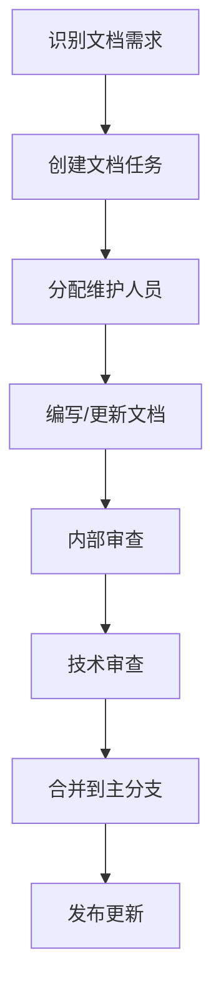

# 文档维护指南

## 文档维护流程

### 1. 文档更新周期

- **日常维护**: 随代码变更同步更新相关文档
- **版本发布**: 每个版本发布前进行全面文档审查
- **定期审查**: 每季度进行一次全面文档审查

### 2. 文档更新流程



### 3. 文档版本管理

- 文档与代码版本保持同步
- 重大变更需要版本标记
- 提供历史版本文档访问

## 文档结构维护

### 1. 目录结构规范

```
docs/
├── getting-started/     # 快速入门指南
├── user-guide/          # 用户使用手册
├── developer-guide/     # 开发者指南
├── architecture/        # 架构设计文档
├── configuration/       # 配置管理文档
├── deployment/          # 部署和运维文档
├── changelog/           # 变更日志
├── faq/                 # 常见问题解答
└── maintenance/         # 维护指南
```

### 2. 文件命名规范

- 使用小写字母和连字符
- 避免特殊字符和空格
- 保持名称简洁明确

### 3. 文档格式规范

- 使用标准Markdown语法
- 保持一致的标题层级
- 使用适当的代码块和示例
- 添加必要的链接和引用

## 内容维护标准

### 1. 准确性

- 确保所有信息与当前版本一致
- 定期验证代码示例的正确性
- 及时更新过时的信息

### 2. 完整性

- 覆盖所有主要功能和特性
- 提供必要的背景信息
- 包含常见问题和解决方案

### 3. 可读性

- 使用清晰简洁的语言
- 保持逻辑结构合理
- 提供适当的图表和示例

### 4. 一致性

- 统一术语和表达方式
- 保持格式和风格一致
- 遵循文档结构规范

## 维护工具

### 1. 文档生成工具

使用工具自动生成部分文档内容：

```makefile
# 生成API文档
.PHONY: docs-api
docs-api:
	@echo "Generating API documentation..."
	@godoc -http=:6060 &

# 生成配置文档
.PHONY: docs-config
docs-config:
	@echo "Generating configuration documentation..."
	@go run tools/generate_config_docs.go
```

### 2. 文档验证工具

```bash
# 检查链接有效性
make docs-check-links

# 检查语法和格式
make docs-lint
```

### 3. 自动化检查

在CI/CD流程中集成文档检查：

```yaml
# .github/workflows/docs.yml
name: Documentation Check
on: [push, pull_request]
jobs:
  docs-check:
    runs-on: ubuntu-latest
    steps:
    - uses: actions/checkout@v3
    - name: Check markdown links
      run: |
        npm install -g markdown-link-check
        find docs -name "*.md" -exec markdown-link-check {} \;
    - name: Lint markdown files
      run: |
        npm install -g markdownlint-cli
        markdownlint docs/**/*.md
```

## 贡献者指南

### 1. 文档贡献流程

1. **Fork仓库**
2. **创建分支**
   ```bash
   git checkout -b docs/feature-name
   ```
3. **编写文档**
4. **提交更改**
   ```bash
   git add .
   git commit -m "docs: add feature documentation"
   ```
5. **推送分支**
   ```bash
   git push origin docs/feature-name
   ```
6. **创建Pull Request**

### 2. 文档编写规范

#### 标题规范

```markdown
# 一级标题 (页面标题)
## 二级标题 (主要章节)
### 三级标题 (子章节)
#### 四级标题 (小节)
```

#### 代码示例

````markdown
```bash
# 命令示例
redis-runner redis -h localhost -p 6379
```

```go
// Go代码示例
func main() {
    fmt.Println("Hello, redis-runner!")
}
```

```yaml
# 配置示例
redis:
  mode: "standalone"
```
````

#### 链接规范

```markdown
[内部链接](../user-guide/redis.md)
[外部链接](https://redis.io)
[API文档](../../api/#function-name)
```

### 3. 审查标准

#### 技术准确性
- 所有技术信息必须准确无误
- 代码示例必须可运行
- 配置示例必须有效

#### 语言质量
- 使用标准中文表达
- 避免语法错误
- 保持专业术语一致

#### 结构完整性
- 遵循文档结构规范
- 保持逻辑清晰
- 提供必要的上下文

## 变更管理

### 1. 变更日志

维护详细的文档变更日志：

```markdown
## [1.2.0] - 2025-09-08

### 🚀 新增

- 添加Kubernetes部署指南
- 增加Docker部署文档

### 🛠️ 改进

- 优化Redis配置文档
- 更新HTTP测试指南

### 📝 修复

- 修正配置示例中的错误
- 修复链接失效问题
```

### 2. 版本标记

在文档中添加版本信息：

```markdown
> 适用于版本 v0.2.0+
```

### 3. 废弃通知

标记废弃的功能和文档：

```markdown
> ⚠️ 此功能已在 v0.2.0 版本中废弃，请使用新功能替代。
```

## 质量保证

### 1. 定期审查

- **月度快速审查**: 检查新内容的准确性
- **季度全面审查**: 全面检查所有文档
- **年度重构**: 重构和优化文档结构

### 2. 用户反馈

- 收集用户对文档的反馈
- 根据反馈改进文档质量
- 建立文档改进任务跟踪

### 3. 测试覆盖率

- 确保代码示例可运行
- 验证配置示例有效性
- 测试命令示例正确性

## 最佳实践

### 1. 内容组织

- 按用户角色组织文档
- 提供快速入门指南
- 建立完整的知识体系

### 2. 搜索优化

- 使用描述性标题
- 添加关键词标签
- 提供搜索功能

### 3. 多语言支持

- 规划多语言文档结构
- 建立翻译流程
- 维护语言版本同步

### 4. 可访问性

- 确保文档可访问性
- 提供多种格式输出
- 支持屏幕阅读器

## 模板和示例

### 1. 文档模板

```markdown
# 文档标题

## 概述

简要介绍文档内容和目标读者。

## 目录

- [章节1](#章节1)
- [章节2](#章节2)

## 章节1

详细内容...

## 章节2

详细内容...

## 相关资源

- [链接1](url1)
- [链接2](url2)
```

### 2. API文档模板

```markdown
## 函数名称

### 描述

函数功能描述。

### 参数

| 参数名 | 类型 | 必需 | 描述 |
|--------|------|------|------|
| param1 | string | 是 | 参数描述 |

### 返回值

返回值描述。

### 示例

```go
// 使用示例
result := function(param1)
```
```

### 3. 配置文档模板

```markdown
## 配置项名称

### 描述

配置项功能描述。

### 类型

数据类型

### 默认值

默认值

### 示例

```yaml
config_item: value
```

### 注意事项

使用注意事项。
```

## 维护团队

### 1. 角色定义

- **文档负责人**: 负责整体文档策略和质量
- **技术作者**: 负责技术内容编写
- **编辑**: 负责语言润色和格式规范
- **审查员**: 负责内容准确性和完整性审查

### 2. 协作流程

- 使用项目管理工具跟踪任务
- 定期召开文档维护会议
- 建立文档贡献者社区

### 3. 培训和支持

- 提供文档编写培训
- 建立文档维护知识库
- 提供技术支持和指导