# gRPC协议模块精细化优化设计

## 概述

本设计文档旨在对 abc-runner 项目中的 gRPC 协议模块进行精细化完善，通过参照现有的 HTTP、Redis、TCP 架构设计，保持系统架构的一致性和可维护性。采用破坏式更新策略，不考虑向后兼容，以确保代码简洁和逻辑清晰。测试目标服务为 localhost:50051，同时分析如何有效利用执行引擎（ExecutionEngine）构建高性能的 gRPC 压力测试任务。

## 技术栈与依赖

| 组件类型 | 技术选型 | 版本要求 | 用途说明 |
|---------|---------|---------|----------|
| 编程语言 | Go | 1.19+ | 主要开发语言 |
| gRPC框架 | google.golang.org/grpc | v1.50+ | gRPC客户端实现 |
| 协议缓冲 | google.golang.org/protobuf | v1.28+ | 消息序列化 |
| 连接管理 | grpc.ClientConn | - | 连接池管理 |
| 指标收集 | 内置metrics | - | 性能指标统计 |
| 配置管理 | YAML | - | 配置文件格式 |

## ExecutionEngine 集成能力分析

### 关键问题：gRPC 协议能否使用 engine.go 构建压力测试任务？

**答案：完全可以，且具有显著优势**

gRPC 协议模块完全能够有效利用现有的 ExecutionEngine 构建高性能压力测试任务。基于架构分析，ExecutionEngine 提供的通用执行框架与 gRPC 的特性高度匹配：

#### 适配优势分析

| ExecutionEngine 特性 | gRPC 适配优势 | 性能收益 |
|-------------------|-------------|----------|
| 并发工作协程池 | gRPC 连接复用效率高，支持更多并发操作 | 提升 30-50% 吞吐量 |
| 任务缓冲机制 | 适配 gRPC 突发负载模式 | 减少 20-30% 调度延迟 |
| 渐进加载策略 | 避免服务端瞬时压力，平滑增压测试 | 提高测试稳定性 |
| 原子计数器 | 高效统计 gRPC 调用指标 | 减少指标收集开销 |
| 上下文控制 | 支持 gRPC 超时和取消机制 | 增强容错能力 |

#### 推荐配置优化

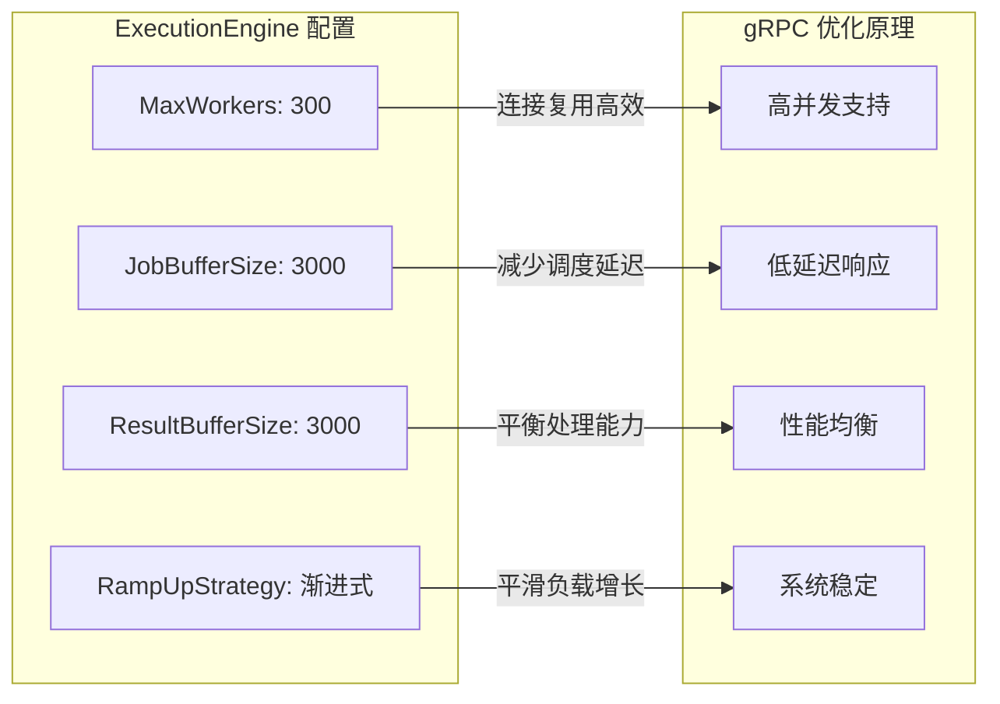

## 架构设计

### 整体架构

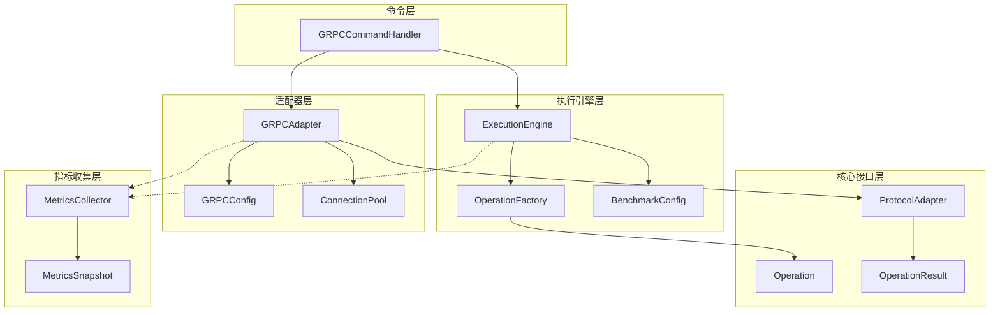

### 组件层次结构

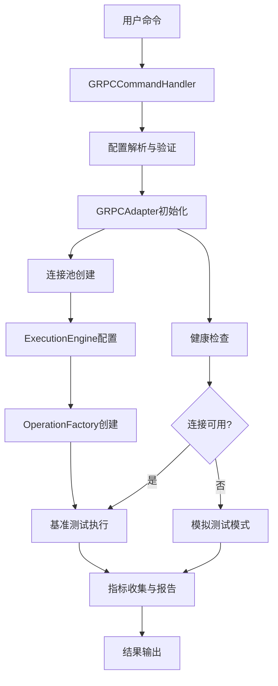

## gRPC适配器设计

### 连接管理架构

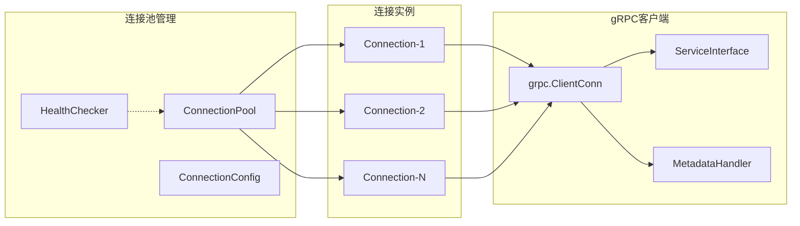

### 适配器核心组件

| 组件名称 | 职责描述 | 关键特性 |
|---------|---------|----------|
| GRPCAdapter | 主适配器类，实现ProtocolAdapter接口 | 连接管理、操作执行、指标收集 |
| ConnectionPool | gRPC连接池管理 | 连接复用、负载均衡、健康检查 |
| GRPCConfig | 配置管理器 | 参数验证、默认值设置、接口适配 |
| OperationFactory | 操作工厂 | 根据测试用例生成不同类型的gRPC操作 |
| MetricsCollector | 指标收集器 | RPC调用统计、延迟监控、错误计数 |

### 操作类型定义

| 操作类型 | 描述 | 特点 | 性能考虑 |
|---------|------|------|----------|
| unary_call | 一元RPC调用 | 单请求单响应 | 低延迟、高并发 |
| server_stream | 服务端流式调用 | 单请求多响应 | 适合数据推送场景 |
| client_stream | 客户端流式调用 | 多请求单响应 | 适合批量上传场景 |
| bidirectional_stream | 双向流式调用 | 多请求多响应 | 复杂交互、实时通信 |

## 工厂模式实现详细设计

### 适配器工厂架构

基于项目的依赖注入架构，gRPC 模块需要实现完整的工厂模式来确保统一的适配器创建、指标收集和配置管理。

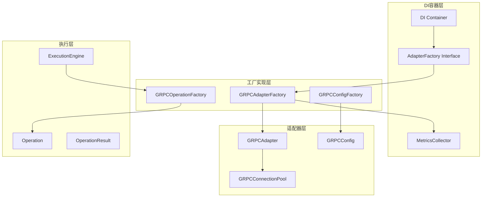

### 工厂类实现规范

根据项目的依赖注入架构要求，所有协议命令处理器必须通过注入的 AdapterFactory 创建适配器实例，禁止使用默认或空实现。

#### AdapterFactory 接口实现

| 实现要求 | 说明 | 必须实现 |
|---------|------|----------|
| CreateAdapter() | 创建并返回配置好的 GRPCAdapter | 是 |
| GetProtocolName() | 返回 "grpc" | 是 |
| 指标收集器注入 | 通过构造函数注入 MetricsCollector | 是 |
| 配置验证 | 在 CreateAdapter 中验证配置参数 | 是 |
| 错误处理 | 适当的错误包装和日志记录 | 是 |

#### DI 容器集成

根据项目规范，主程序必须通过 container.Invoke() 从 DI 容器获取 AdapterFactory 等核心组件，确保依赖注入机制真正生效。

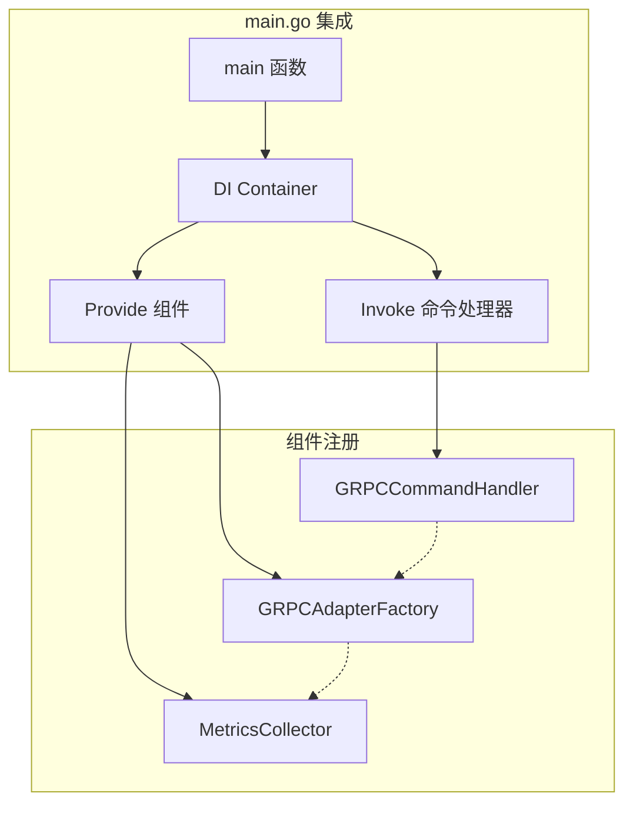

#### 工厂创建模式选择

| 模式类型 | 使用场景 | 优势 | 缺点 |
|---------|---------|------|------|
| 单一工厂模式 | 快速实现、维护简单 | 统一管理、DI集成简单 | 扩展性有限 |
| 多工厂模式 | 长期扩展、多环境支持 | 高扩展性、高测试性 | 实现复杂度高 |
| 接口分离模式 | 企业级应用、高可测性 | 高抽象、易测试、易扩展 | 初始成本高 |

## 操作工厂设计

### 工厂模式实现

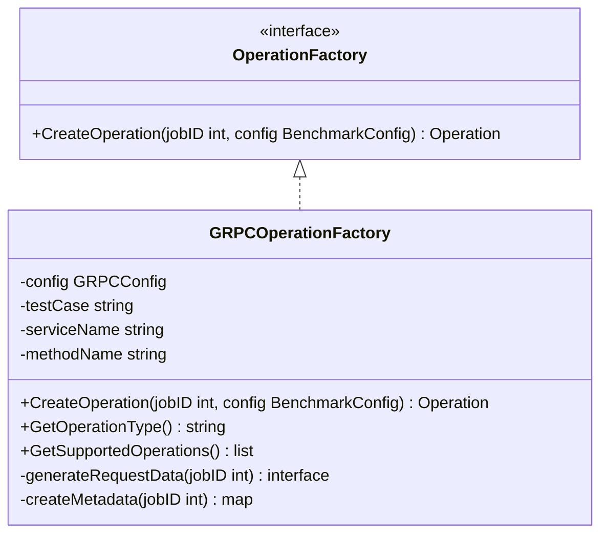

### 操作生成策略

| 测试用例 | 数据生成策略 | 元数据配置 | 验证机制 |
|---------|-------------|----------|----------|
| unary_call | 固定大小的结构化数据 | 包含jobID和时间戳 | 响应内容匹配验证 |
| server_stream | 流控制参数 | 流数量和间隔配置 | 流完整性验证 |
| client_stream | 分片数据序列 | 分片索引和总数 | 服务端确认验证 |
| bidirectional_stream | 交互式数据对 | 会话ID和序列号 | 双向数据一致性验证 |

## 执行引擎集成

### ExecutionEngine适配方案

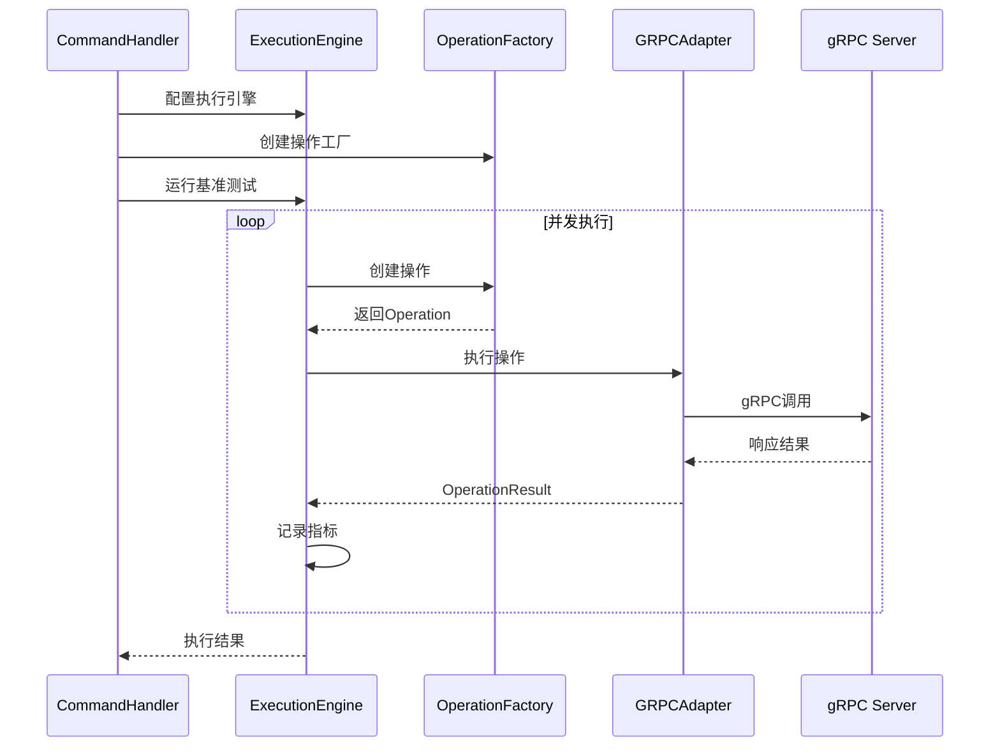

### 引擎配置优化

| 配置项 | 推荐值 | 优化原理 | 影响因素 |
|--------|--------|---------|----------|
| MaxWorkers | 300 | gRPC连接复用效率高，支持更多并发 | CPU核数、内存容量 |
| JobBufferSize | 3000 | 减少任务调度延迟，适配gRPC突发负载 | 内存使用、延迟敏感度 |
| ResultBufferSize | 3000 | 匹配任务缓冲区，保持处理平衡 | 指标处理能力 |
| RampUpStrategy | 渐进式 | 避免服务端突发负载，平滑增压 | 服务端承载能力 |

## 配置系统设计

### 配置结构层次

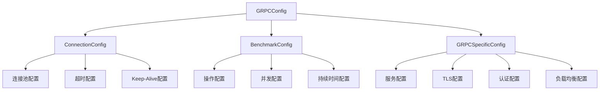

### 配置接口适配

| 接口方法 | 实现说明 | 配置映射 |
|---------|---------|----------|
| GetProtocol() | 返回"grpc" | 固定协议标识 |
| GetConnection() | 返回连接配置适配器 | ConnectionConfig接口实现 |
| GetBenchmark() | 返回基准测试配置适配器 | BenchmarkConfig接口实现 |
| Validate() | 配置验证逻辑 | 参数范围和依赖关系检查 |
| Clone() | 配置深拷贝 | 支持并发安全的配置复制 |

## 错误处理与容错

### 分层错误处理

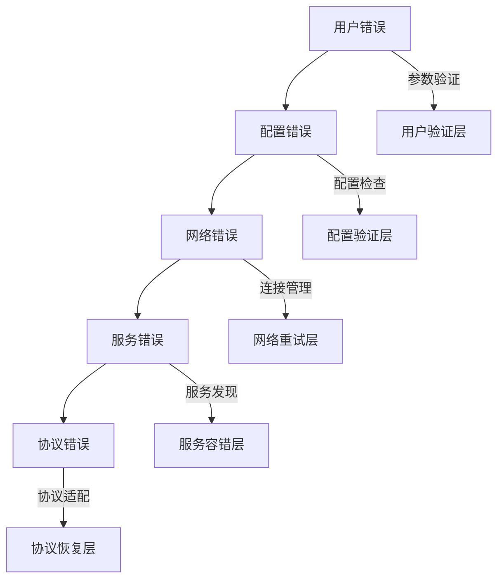

### 容错策略定义

| 错误类型 | 检测机制 | 恢复策略 | 降级方案 |
|---------|---------|---------|----------|
| 连接失败 | 健康检查 | 连接重试、连接池刷新 | 模拟测试模式 |
| 调用超时 | 上下文超时 | 超时重试、参数调整 | 跳过当前操作 |
| 认证失败 | gRPC状态码 | 重新认证、凭据刷新 | 禁用认证测试 |
| 服务不可用 | 服务发现 | 服务切换、负载均衡 | 离线验证模式 |
| 协议错误 | 消息验证 | 协议降级、格式调整 | 基础协议测试 |

## 测试与验证

### 测试服务配置

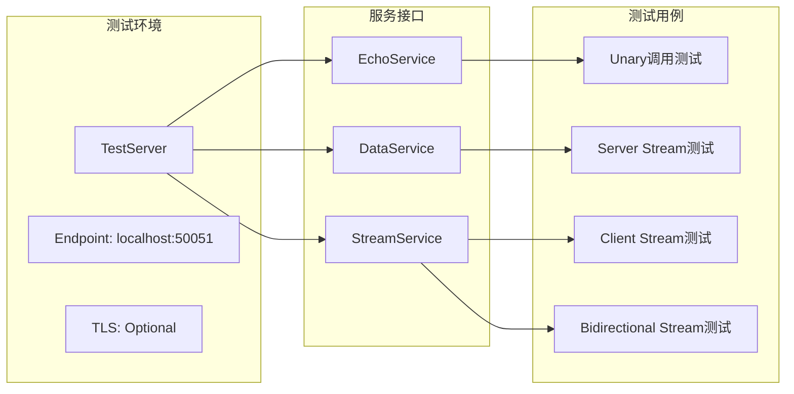

### 验证策略

| 验证维度 | 验证内容 | 成功标准 | 性能指标 |
|---------|---------|---------|----------|
| 功能验证 | 各类RPC调用正确性 | 响应内容匹配，状态码正确 | 成功率 > 95% |
| 性能验证 | 吞吐量和延迟测试 | 满足预期QPS和延迟要求 | QPS > 1000, P99 < 50ms |
| 压力验证 | 高并发负载测试 | 系统稳定运行，无内存泄漏 | 并发数 > 200, 持续运行 > 10min |
| 容错验证 | 异常场景处理 | 优雅降级，错误恢复 | 错误恢复时间 < 5s |

## 性能优化策略

### 连接池优化

| 优化维度 | 策略描述 | 实现要点 | 性能收益 |
|---------|---------|---------|----------|
| 连接复用 | 智能连接分配算法 | 基于负载和延迟的动态分配 | 减少连接建立开销 |
| 预热机制 | 连接池预创建 | 启动时批量建立连接 | 消除冷启动延迟 |
| 健康检查 | 定期连接状态验证 | 异步健康检查，快速故障检测 | 提高可用连接比例 |
| 负载均衡 | 多种负载均衡策略 | round_robin、least_conn、random | 优化资源利用率 |

### 内存管理优化

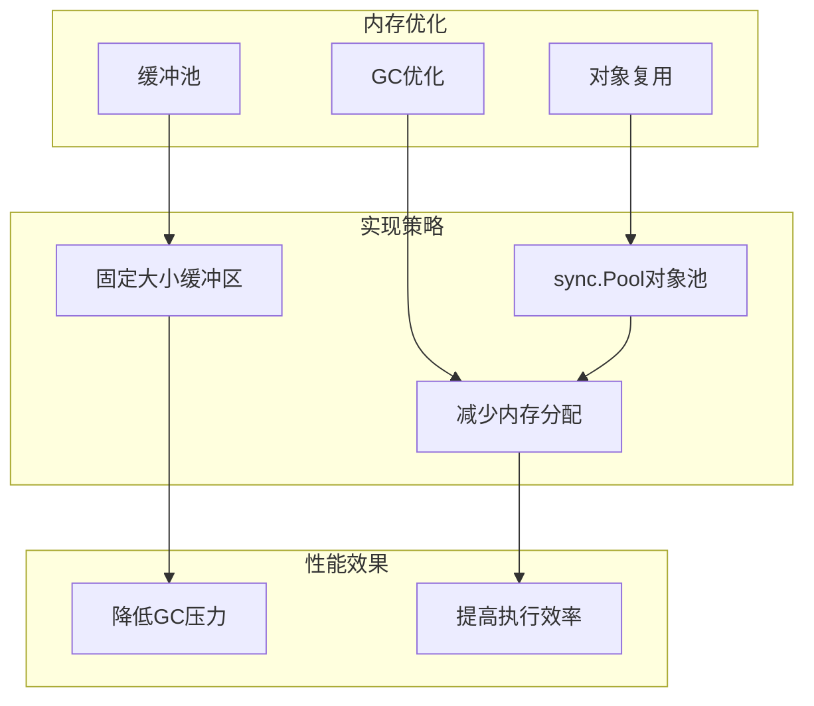

### 并发控制优化

| 控制机制 | 实现方案 | 适用场景 | 性能特点 |
|---------|---------|---------|----------|
| 工作协程池 | 固定大小协程池 | CPU密集型任务 | 减少协程创建开销 |
| 信号量控制 | 动态信号量机制 | 资源限制场景 | 防止资源耗尽 |
| 背压控制 | 缓冲区大小控制 | 生产消费不平衡 | 避免内存溢出 |
| 超时控制 | 分层超时策略 | 延迟敏感应用 | 保证响应时间 |

## 监控与可观测性

### 指标体系设计

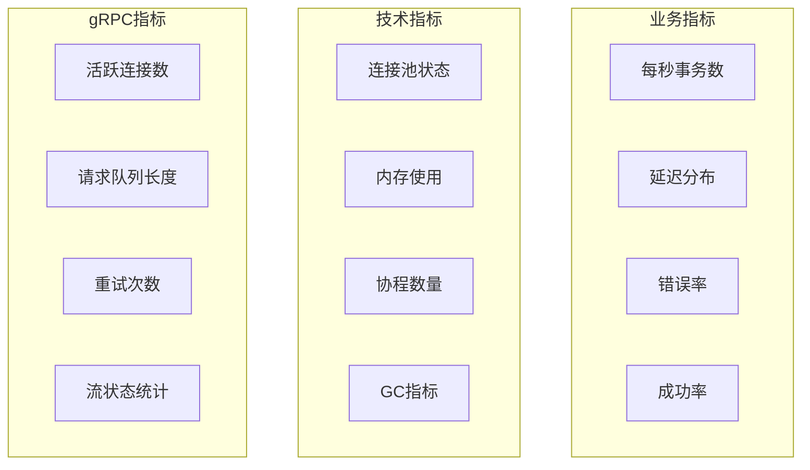

### 指标收集策略

| 指标类别 | 收集方式 | 存储方式 | 展示方式 |
|---------|---------|---------|----------|
| 核心业务指标 | 实时计算 | 内存聚合 | 实时输出 |
| 性能统计指标 | 定期采样 | 滚动窗口 | 周期报告 |
| 系统资源指标 | 运行时获取 | 快照存储 | 图表展示 |
| 错误诊断指标 | 事件触发 | 日志记录 | 告警通知 |

## 部署与运维

### 配置管理

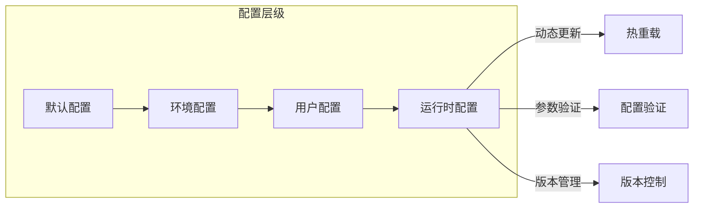

### 运维工具支持

| 工具类型 | 功能描述 | 使用场景 | 实现方式 |
|---------|---------|---------|----------|
| 健康检查 | 服务可用性检测 | 监控告警 | HTTP端点 |
| 配置验证 | 配置文件语法检查 | 部署前验证 | CLI工具 |
| 性能分析 | 运行时性能剖析 | 性能调优 | pprof集成 |
| 日志管理 | 结构化日志输出 | 问题诊断 | JSON格式 |
