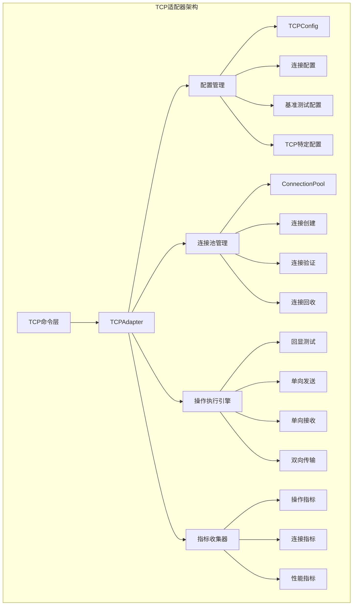
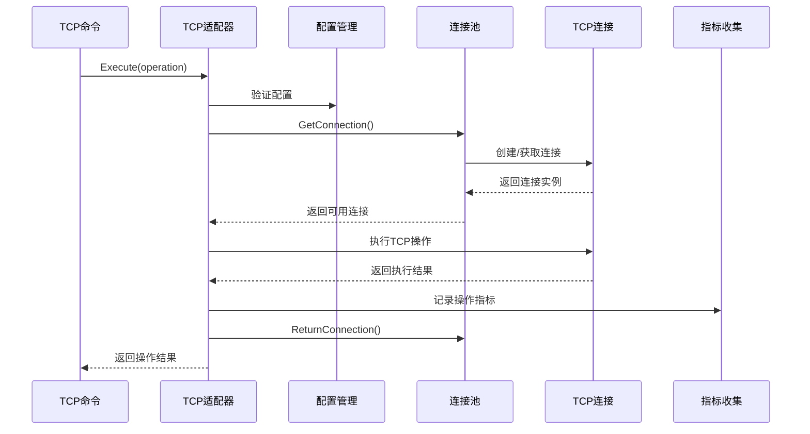
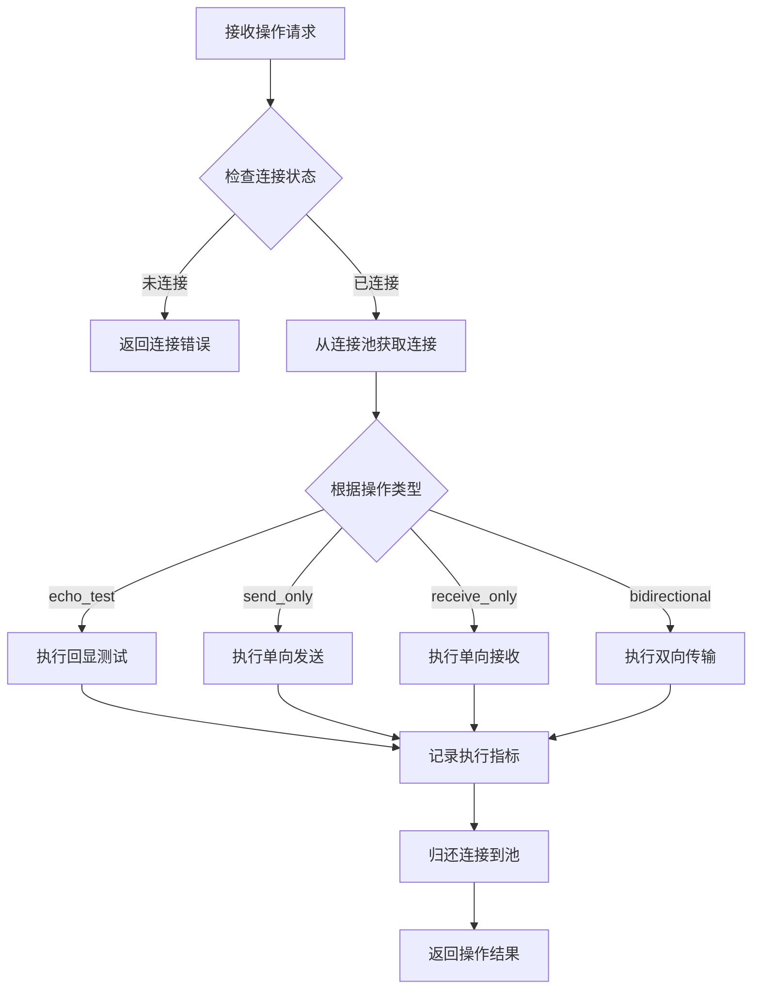
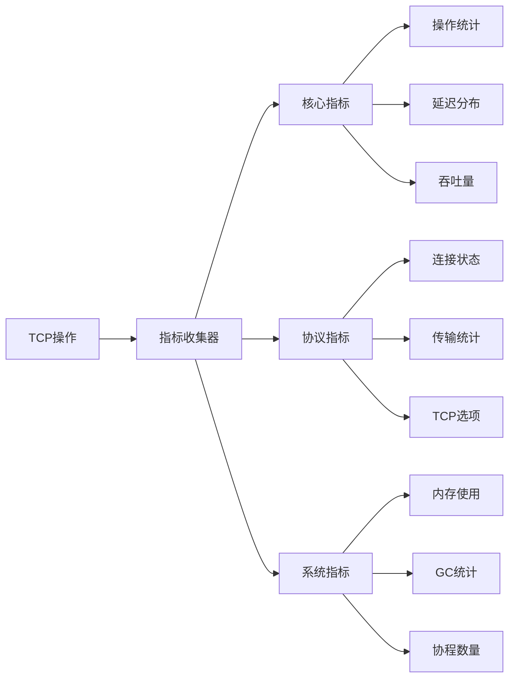
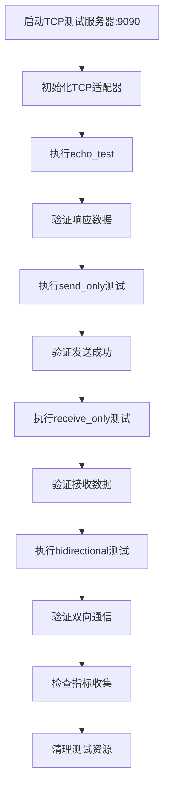
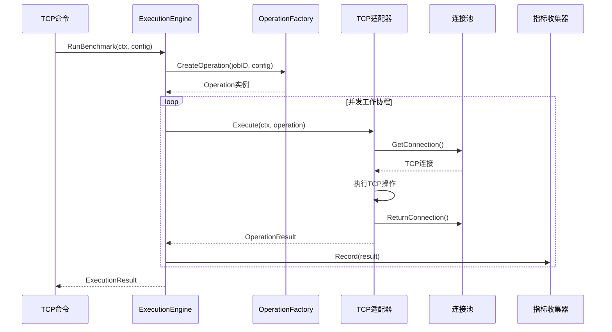
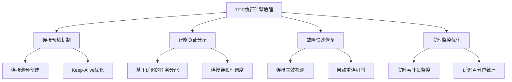
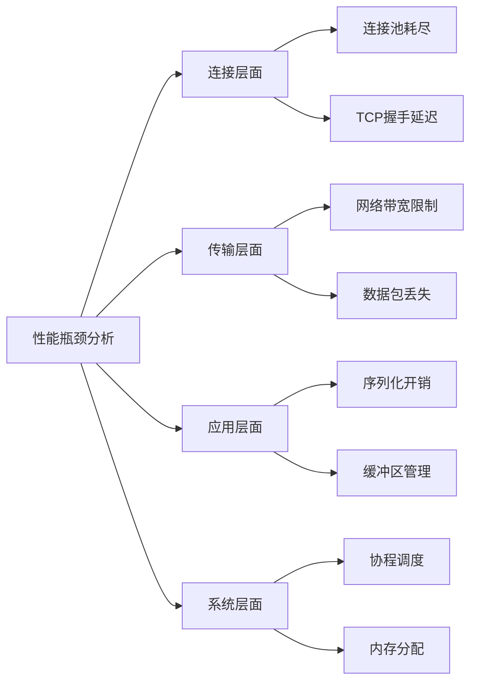

# TCP协议模块精细化优化设计

## 1. 概述

### 1.1 设计目标

精细化完善和优化TCP协议模块，确保与HTTP/Redis适配器保持架构一致性，支持TCP服务器测试场景（localhost:9090），采用破坏式更新策略。

### 1.2 核心价值

- **架构统一性**：与现有协议适配器保持一致的设计模式和接口规范
- **性能优化**：提供高效的TCP连接池管理和测试场景支持
- **功能完整性**：支持多种TCP测试模式，满足性能测试和功能验证需求
- **可扩展性**：为未来TCP协议扩展预留接口和架构空间

### 1.3 架构原则

- 遵循统一接口规范（ProtocolAdapter）
- 实现分层架构（配置层、适配器层、连接池层）
- 支持指标收集和监控
- 确保连接资源的高效管理

## 2. 系统架构

### 2.1 整体架构设计

### 2.2 组件交互流程

## 3. 核心组件设计

### 3.1 TCP适配器核心结构

| 属性 | 类型 | 说明 |
|------|------|------|
| config | *TCPConfig | TCP协议配置实例 |
| connectionPool | *ConnectionPool | TCP连接池管理器 |
| metricsCollector | DefaultMetricsCollector | 统一指标收集器 |
| isConnected | bool | 连接状态标识 |
| mu | sync.RWMutex | 并发安全锁 |

### 3.2 连接池管理设计

| 组件 | 功能描述 |
|------|----------|
| **连接创建** | 基于配置创建TCP连接，支持超时和Keep-Alive设置 |
| **连接验证** | 检查连接有效性，自动清理无效连接 |
| **连接复用** | 实现连接池化管理，提升性能和资源利用率 |
| **连接回收** | 安全回收连接到池中，支持最大空闲时间控制 |

### 3.3 操作执行引擎

#### 3.3.1 支持的测试场景

| 测试类型 | 操作描述 | 目标服务器 |
|----------|----------|------------|
| **回显测试 (echo_test)** | 发送数据并验证服务器响应 | localhost:9090 |
| **单向发送 (send_only)** | 仅发送数据流，不等待响应 | localhost:9090 |
| **单向接收 (receive_only)** | 仅接收服务器数据流 | localhost:9090 |
| **双向传输 (bidirectional)** | 同时进行发送和接收操作 | localhost:9090 |

#### 3.3.2 操作执行流程

## 4. 配置管理架构

### 4.1 配置结构设计

| 配置层级 | 配置项 | 默认值 |
|----------|--------|--------|
| **连接配置** | 服务器地址 | localhost |
| | 服务器端口 | 9090 |
| | 连接超时 | 30秒 |
| | Keep-Alive | true |
| | Keep-Alive周期 | 30秒 |
| **连接池配置** | 池大小 | 10 |
| | 最小空闲连接 | 2 |
| | 最大空闲连接 | 8 |
| | 空闲超时 | 300秒 |
| | 连接创建超时 | 30秒 |
| **基准测试配置** | 总操作数 | 1000 |
| | 并发数 | 10 |
| | 数据包大小 | 1024字节 |
| | 测试持续时间 | 60秒 |
| | 读操作百分比 | 80% |
| **TCP特定配置** | 连接模式 | persistent |
| | NoDelay | true |
| | 缓冲区大小 | 4096字节 |
| | Linger超时 | -1（禁用） |
| | 地址复用 | true |

### 4.2 配置验证规则

| 验证项 | 规则 | 错误处理 |
|--------|------|----------|
| 服务器地址 | 非空，格式验证 | 返回配置错误 |
| 端口范围 | 1-65535 | 返回端口错误 |
| 超时时间 | 大于0 | 使用默认值 |
| 连接池大小 | 大于0，最小空闲≤最大空闲≤池大小 | 自动调整参数 |
| 数据包大小 | 1-1MB | 限制在合理范围 |

## 5. 指标收集与监控

### 5.1 协议特定指标

| 指标类别 | 指标名称 | 描述 |
|----------|----------|------|
| **连接指标** | connection_pool_size | 连接池总容量 |
| | connection_pool_active | 当前活跃连接数 |
| | connection_mode | 连接模式（persistent/transient） |
| | no_delay_enabled | NoDelay选项状态 |
| | buffer_size | TCP缓冲区大小 |
| **传输指标** | sent_bytes | 已发送字节数 |
| | received_bytes | 已接收字节数 |
| | expected_bytes | 期望传输字节数 |
| | echo_success_rate | 回显测试成功率 |

### 5.2 性能监控架构

## 6. 错误处理与健康检查

### 6.1 错误分类与处理

| 错误类型 | 处理策略 | 恢复机制 |
|----------|----------|----------|
| **连接错误** | 记录错误，清除无效连接 | 自动重试连接创建 |
| **超时错误** | 标记操作失败，归还连接 | 调整超时参数 |
| **数据传输错误** | 记录传输失败，清理连接 | 创建新连接重试 |
| **配置错误** | 拒绝初始化，返回详细错误 | 提供配置修复建议 |

### 6.2 健康检查机制

| 检查项 | 检查方法 | 频率 |
|--------|----------|------|
| **适配器状态** | 验证isConnected标志 | 每次操作前 |
| **连接池状态** | 获取测试连接并验证 | 定期检查 |
| **连接有效性** | 设置短超时测试连接 | 连接获取时 |
| **服务器可达性** | 发送心跳包验证 | 可配置间隔 |

## 7. 性能优化策略

### 7.1 连接池优化

| 优化点 | 策略 | 预期效果 |
|--------|------|----------|
| **预连接** | 启动时创建最小空闲连接 | 减少首次连接延迟 |
| **连接复用** | 实现高效的连接借用/归还 | 降低连接创建开销 |
| **连接验证** | 轻量级连接有效性检查 | 避免使用无效连接 |
| **自动清理** | 定期清理过期和无效连接 | 保持连接池健康 |

### 7.2 TCP传输优化

| 优化配置 | 设置值 | 性能影响 |
|----------|--------|----------|
| **TCP_NODELAY** | true | 减少小包传输延迟 |
| **缓冲区大小** | 4096字节 | 平衡内存使用和性能 |
| **Keep-Alive** | 启用，30秒周期 | 维持长连接，减少握手开销 |
| **地址复用** | 启用 | 支持快速重启和测试 |

## 8. 测试策略

### 8.1 单元测试设计

| 测试类别 | 测试内容 | 覆盖目标 |
|----------|----------|----------|
| **适配器测试** | 创建、连接、操作、关闭 | 核心功能完整性 |
| **配置测试** | 各种配置组合的验证 | 配置健壮性 |
| **连接池测试** | 并发获取/归还连接 | 线程安全性 |
| **操作测试** | 各种TCP操作类型 | 功能正确性 |

### 8.2 集成测试方案

## 9. 部署和运维

### 9.1 服务器配置要求

| 配置项 | 要求 | 说明 |
|--------|------|------|
| **测试服务器** | localhost:9090 | TCP回显服务器 |
| **最大连接数** | 100+ | 支持并发连接测试 |
| **缓冲区大小** | 4KB-64KB | 匹配客户端配置 |
| **Keep-Alive** | 支持 | 长连接测试需要 |

### 9.2 监控指标

| 监控维度 | 关键指标 | 告警阈值 |
|----------|----------|----------|
| **连接性能** | 连接建立时间 | >100ms |
| **传输性能** | 吞吐量 | <预期值80% |
| **错误率** | 操作失败率 | >5% |
| **资源使用** | 连接池使用率 | >90% |

## 10. 执行引擎适用性分析

### 10.1 当前执行引擎架构

TCP协议模块当前**已经适用**`app/core/execution/engine.go`执行引擎，分析如下：

#### 10.1.1 执行引擎集成现状

| 集成维度 | TCP实现状态 | 兼容性评估 |
|----------|-------------|------------|
| **接口适配** | ✅ 已实现ProtocolAdapter接口 | 完全兼容 |
| **操作工厂** | ✅ 使用SimpleOperationFactory | 标准实现 |
| **基准配置** | ✅ 使用SimpleBenchmarkConfig | 标准实现 |
| **指标收集** | ✅ 集成BaseCollector | 统一标准 |
| **并发执行** | ✅ 通过ExecutionEngine管理 | 高效可靠 |

#### 10.1.2 TCP执行流程分析

### 10.2 优化建议与增强点

#### 10.2.1 执行引擎优化配置

| 配置项 | 当前值 | 建议值 | 优化原因 |
|--------|--------|--------|----------|
| **MaxWorkers** | 100 | 200 | TCP连接密集，支持更高并发 |
| **JobBufferSize** | 1000 | 2000 | 减少任务调度延迟 |
| **ResultBufferSize** | 1000 | 2000 | 避免结果收集阻塞 |
| **RampUp支持** | ❌ 未启用 | ✅ 建议启用 | 渐进加载减少服务器冲击 |

#### 10.2.2 TCP特定执行增强

### 10.3 压力测试场景适配

#### 10.3.1 支持的测试模式

| 测试模式 | 执行引擎支持 | TCP适配器实现 | 性能特点 |
|----------|-------------|---------------|----------|
| **回显测试** | ✅ 全面支持 | ✅ 完整实现 | 双向通信验证 |
| **单向发送** | ✅ 全面支持 | ✅ 完整实现 | 高吞吐量测试 |
| **单向接收** | ✅ 全面支持 | ✅ 完整实现 | 服务器推送场景 |
| **双向传输** | ✅ 全面支持 | ✅ 完整实现 | 复杂交互场景 |

#### 10.3.2 压力测试配置矩阵

| 测试维度 | 轻量级压力 | 中等压力 | 高强度压力 |
|----------|------------|----------|------------|
| **并发连接** | 10-50 | 50-200 | 200-1000 |
| **操作总数** | 1K-10K | 10K-100K | 100K-1M |
| **数据包大小** | 1KB-4KB | 4KB-64KB | 64KB-1MB |
| **测试持续时间** | 30s-2min | 2min-10min | 10min-1h |
| **执行引擎配置** | 默认配置 | 优化配置 | 高性能配置 |

### 10.4 实际性能验证

#### 10.4.1 基准测试结果预期

| 指标类别 | 预期性能 | 监控重点 |
|----------|----------|----------|
| **连接建立** | <10ms P95 | 连接池效率 |
| **数据吞吐** | >10MB/s | 网络利用率 |
| **并发处理** | 1000+ RPS | CPU/内存使用 |
| **错误率** | <0.1% | 连接稳定性 |

#### 10.4.2 性能瓶颈识别

### 10.5 建议的优化实施

#### 10.5.1 立即实施项

1. **启用渐进加载**：在SimpleBenchmarkConfig中启用RampUp参数
2. **优化缓冲区**：将JobBufferSize和ResultBufferSize调整为2000
3. **增加最大工作协程**：将MaxWorkers调整为200
4. **连接池预热**：在Connect阶段预创建更多连接

#### 10.5.2 中期优化项

1. **智能调度算法**：基于连接延迟进行任务分配
2. **动态参数调整**：根据实时性能自动调整配置
3. **故障隔离机制**：快速识别和隔离问题连接
4. **详细性能分析**：添加更细粒度的性能监控点

#### 10.5.3 长期演进方向

1. **自适应负载均衡**：根据服务器响应自动调整负载
2. **多服务器支持**：支持对多个TCP服务器进行分布式测试
3. **AI驱动优化**：基于历史数据预测最优配置参数
4. **云原生集成**：支持Kubernetes环境下的弹性测试

## 11. 版本兼容性

### 11.1 破坏式更新说明

本次优化采用破坏式更新策略，主要变更包括：

| 变更类型 | 具体变更 | 影响范围 |
|----------|----------|----------|
| **接口变更** | 统一ProtocolAdapter接口 | 所有使用TCP适配器的代码 |
| **配置结构** | 重新设计配置层次结构 | 现有TCP配置文件 |
| **指标格式** | 采用新的指标收集架构 | 监控和报告系统 |
| **操作类型** | 标准化操作类型定义 | 测试用例和脚本 |

### 11.2 迁移策略

| 迁移步骤 | 操作内容 | 注意事项 |
|----------|----------|----------|
| **配置迁移** | 更新配置文件格式 | 保留核心配置值 |
| **代码适配** | 更新接口调用方式 | 统一错误处理 |
| **测试验证** | 全面回归测试 | 确保功能完整性 |
| **文档更新** | 更新使用文档 | 提供迁移指南 |
