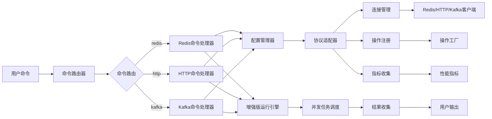
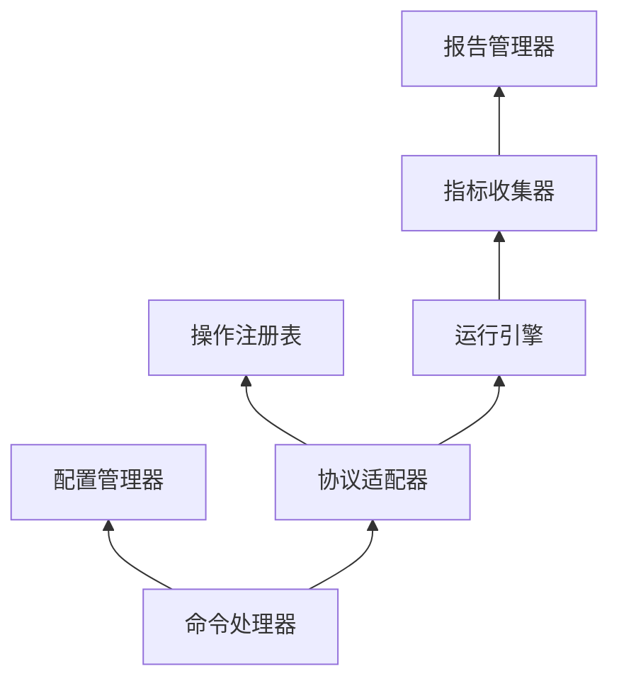

# 组件详解

[English](../en/architecture/components.md) | [中文](components.md)

## 核心组件

### 1. 主程序 (main.go)

主程序是redis-runner的入口点，负责初始化系统并启动命令处理流程。

**主要功能**:
- 初始化日志系统
- 设置命令路由器
- 解析命令行参数
- 执行相应命令

**关键代码结构**:
```go
func main() {
    initLogging()
    initializeCommandSystem()
    executeCommand()
}
```

### 2. 命令路由器 (SimpleCommandRouter)

命令路由器负责将用户输入的命令路由到相应的处理器。

**主要功能**:
- 命令注册和管理
- 别名解析
- 命令执行

**接口定义**:
```go
type CommandHandler interface {
    Execute(ctx context.Context, args []string) error
    GetHelp() string
}
```

### 3. 命令处理器

每种协议都有对应的命令处理器，负责处理特定协议的命令。

#### Redis命令处理器
位于`app/commands/redis.go`，处理Redis相关的命令和参数。

#### HTTP命令处理器
位于`app/commands/http.go`，处理HTTP相关的命令和参数。

#### Kafka命令处理器
位于`app/commands/kafka.go`，处理Kafka相关的命令和参数。

## 协议适配器层

### 1. Redis适配器 (app/adapters/redis)

Redis适配器为Redis协议提供统一接口。

**主要组件**:
- **连接管理**: 管理Redis连接池
- **操作执行**: 执行各种Redis操作
- **指标收集**: 收集性能指标
- **配置处理**: 处理Redis特定配置

**关键接口**:
```go
type RedisAdapter struct {
    client redis.UniversalClient
    config *config.RedisConfig
    metrics *collector.MetricsCollector
}
```

### 2. HTTP适配器 (app/adapters/http)

HTTP适配器为HTTP协议提供统一接口。

**主要组件**:
- **客户端管理**: 管理HTTP客户端
- **请求构建**: 构建HTTP请求
- **响应处理**: 处理HTTP响应
- **连接池**: 管理HTTP连接

### 3. Kafka适配器 (app/adapters/kafka)

Kafka适配器为Kafka协议提供统一接口。

**主要组件**:
- **生产者管理**: 管理Kafka生产者
- **消费者管理**: 管理Kafka消费者
- **消息处理**: 处理Kafka消息
- **配置管理**: 管理Kafka配置

## 配置管理层

### 1. 配置管理器 (app/core/config)

配置管理器提供统一的配置加载和管理功能。

**主要功能**:
- 多源配置加载（命令行、YAML、环境变量）
- 配置优先级处理
- 配置验证
- 配置热重载（计划中）

**核心结构**:
```go
type ConfigManager struct {
    config interfaces.Config
    loader *MultiSourceLoader
}
```

### 2. 配置加载器 (app/core/config/multi_source_loader.go)

多源配置加载器支持从不同来源加载配置。

**支持的配置源**:
- 命令行参数
- YAML配置文件
- 环境变量
- 默认值

### 3. 协议配置

每种协议都有对应的配置结构和加载逻辑。

#### Redis配置 (app/adapters/redis/config)
```go
type RedisConfig struct {
    Mode      string         `yaml:"mode"`
    Benchmark BenchmarkConfig `yaml:"benchmark"`
    Pool      PoolConfig      `yaml:"pool"`
    // ...
}
```

#### HTTP配置 (app/adapters/http/config)
```go
type HTTPConfig struct {
    Connection ConnectionConfig `yaml:"connection"`
    Requests   []RequestConfig  `yaml:"requests"`
    // ...
}
```

#### Kafka配置 (app/adapters/kafka/config)
```go
type KafkaConfig struct {
    Brokers  []string        `yaml:"brokers"`
    Producer ProducerConfig  `yaml:"producer"`
    Consumer ConsumerConfig  `yaml:"consumer"`
    // ...
}
```

## 操作管理层

### 1. 操作注册表 (app/core/utils/operation_registry.go)

操作注册表管理所有可用的操作类型。

**主要功能**:
- 操作工厂注册
- 操作实例创建
- 操作类型管理

**接口定义**:
```go
type OperationFactory interface {
    CreateOperation(params map[string]interface{}) (interfaces.Operation, error)
    GetOperationType() string
    ValidateParams(params map[string]interface{}) error
}
```

### 2. 操作工厂

每种操作类型都有对应的工厂类，负责创建操作实例。

#### Redis操作工厂 (app/adapters/redis/operations.go)
- StringGetOperationFactory
- StringSetOperationFactory
- SetGetRandomOperationFactory
- PublishOperationFactory
- 等等...

#### HTTP操作工厂 (app/adapters/http/operations.go)
- HTTPOperationFactory

#### Kafka操作工厂 (app/adapters/kafka/operations.go)
- KafkaOperationFactory

## 运行引擎层

### 1. 增强版运行引擎 (app/core/runner/enhanced_runner.go)

运行引擎是执行基准测试的核心组件。

**主要功能**:
- 并发任务调度
- 负载生成
- 结果收集
- 性能监控

**核心算法**:
```go
func (r *EnhancedRunner) RunBenchmark(ctx context.Context) (*interfaces.Metrics, error) {
    // 1. 初始化工作池
    // 2. 启动监控协程
    // 3. 执行测试
    // 4. 收集结果
    // 5. 计算指标
}
```

### 2. 并发控制

使用Go协程和通道实现高效的并发控制。

**工作池实现**:
```go
type WorkerPool struct {
    workers    int
    jobQueue   chan Job
    resultChan chan Result
    wg         sync.WaitGroup
}
```

## 指标收集层

### 1. 指标收集器 (app/core/interfaces/metrics.go)

定义统一的指标收集接口。

**核心指标**:
- RPS (Requests Per Second)
- 延迟分布 (Latency Distribution)
- 错误率 (Error Rate)
- 吞吐量 (Throughput)

### 2. 协议特定指标收集

每种协议都有对应的指标收集实现。

#### Redis指标收集 (app/adapters/redis/metrics)
- 连接池状态
- 命令执行统计
- 内存使用情况

#### HTTP指标收集 (app/adapters/http/metrics)
- 响应状态码分布
- 连接复用统计
- 网络延迟

#### Kafka指标收集 (app/adapters/kafka/metrics)
- 生产者指标
- 消费者指标
- 分区分布

## 报告管理层

### 1. 报告管理器 (app/core/reports/manager.go)

报告管理器负责生成和输出各种格式的测试报告。

**支持的报告格式**:
- 控制台输出
- JSON格式
- CSV格式
- 文本格式

### 2. 报告生成器

每种报告格式都有对应的生成器。

#### 控制台报告生成器
提供详细的控制台输出，包括性能指标和统计信息。

#### JSON报告生成器
生成结构化的JSON报告，便于程序解析和处理。

#### CSV报告生成器
生成CSV格式的报告，便于导入电子表格软件进行分析。

## 工具层

### 1. 上下文管理 (app/core/utils/context.go)

提供统一的上下文管理功能。

**主要功能**:
- 超时控制
- 取消信号
- 上下文传递

### 2. 解析器 (app/core/utils/parser.go)

提供通用的参数解析功能。

**支持的解析类型**:
- 时间 duration
- 大小 size
- 布尔值 boolean

### 3. 统计工具 (app/core/utils/statistics.go)

提供统计计算功能。

**支持的统计计算**:
- 平均值
- 百分位数
- 标准差
- 分布统计

## 错误处理层

### 1. 错误处理器 (app/core/error/handler.go)

提供统一的错误处理机制。

**错误分类**:
- 配置错误
- 连接错误
- 执行错误
- 系统错误

### 2. 错误包装

使用Go的错误包装机制保留错误上下文。

```go
return fmt.Errorf("failed to execute operation: %w", err)
```

## 测试层

### 1. 单元测试

每个组件都有对应的单元测试。

**测试目录结构**:
```
app/
├── adapters/
│   ├── redis/
│   │   └── test/
│   ├── http/
│   │   └── test/
│   └── kafka/
│       └── test/
└── core/
    └── utils/
        └── test/
```

### 2. 集成测试

提供集成测试验证组件间的交互。

### 3. 性能测试

提供基准测试验证性能指标。

## 组件交互关系

### 1. 数据流向



### 2. 依赖关系



## 扩展点

### 1. 协议扩展

通过实现ProtocolAdapter接口添加新协议支持。

### 2. 操作扩展

通过实现OperationFactory接口添加新操作类型。

### 3. 报告扩展

通过实现ReportGenerator接口添加新报告格式。

### 4. 指标扩展

通过实现MetricsCollector接口添加自定义指标收集。

## 最佳实践

### 1. 接口设计

- 保持接口简洁
- 遵循单一职责原则
- 提供合理的默认实现

### 2. 错误处理

- 及时处理错误
- 提供有意义的错误信息
- 使用错误包装保留上下文

### 3. 并发安全

- 使用互斥锁保护共享资源
- 避免数据竞争
- 正确使用通道进行通信

### 4. 性能优化

- 复用对象减少GC压力
- 使用连接池减少连接开销
- 批处理提高吞吐量

### 5. 可测试性

- 依赖注入便于mock
- 接口隔离便于单元测试
- 提供测试辅助工具