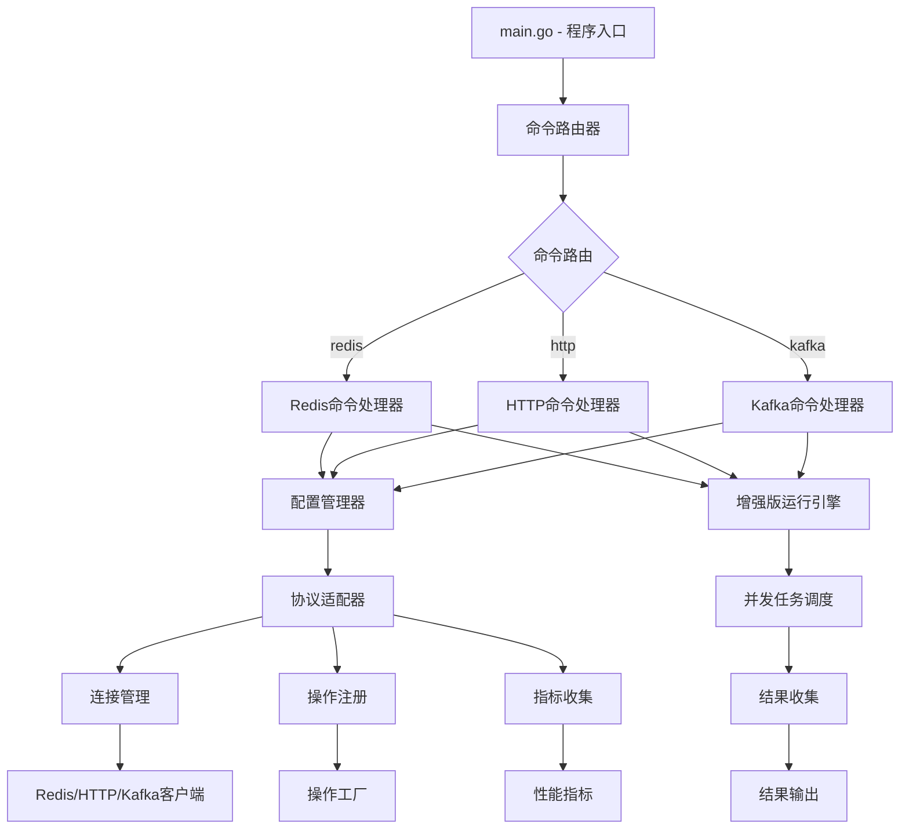
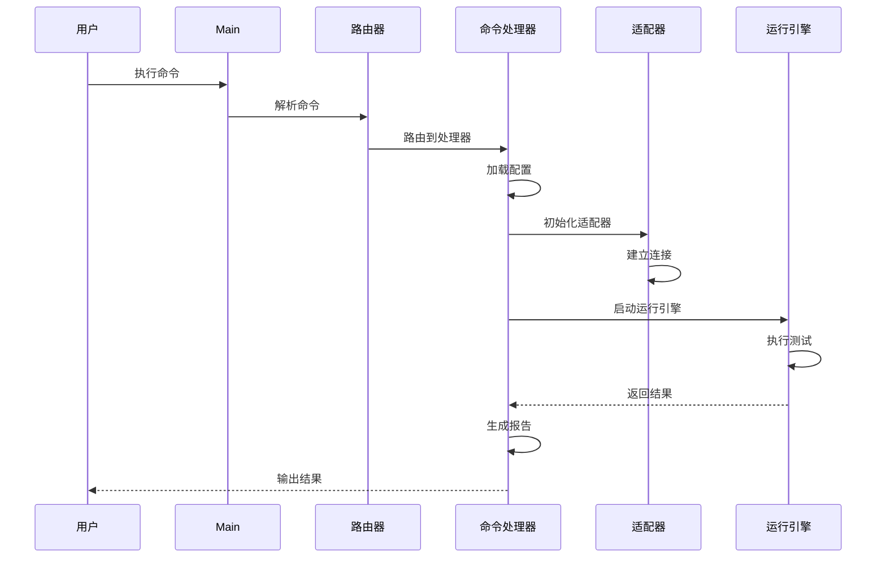
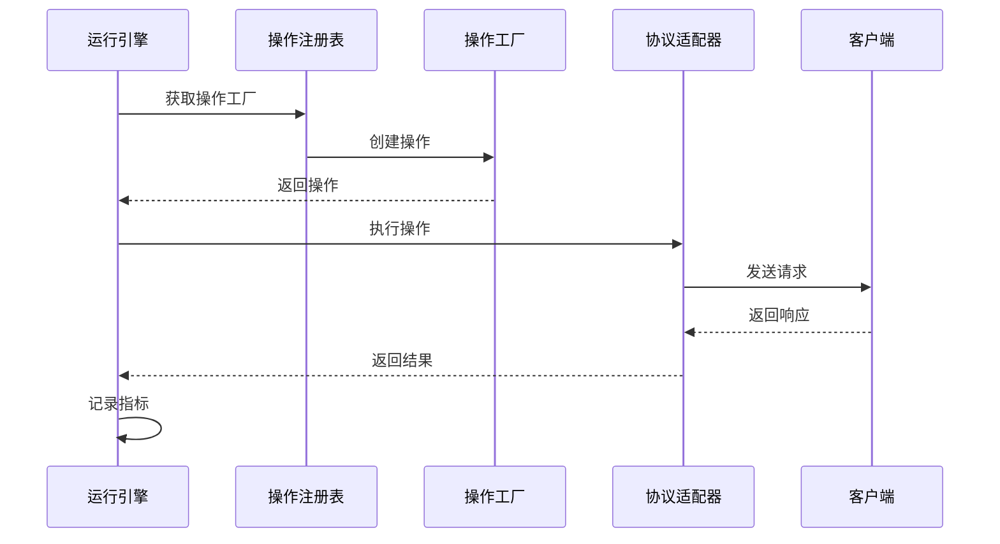

# 架构概述

[English](../en/architecture/overview.md) | [中文](overview.md)

## 系统架构

abc-runner采用模块化、分层架构设计，具有清晰的组件边界和职责分离。



## 核心组件

### 1. 命令路由器 (Command Router)

负责解析命令行参数并将命令路由到相应的处理器。

**主要职责**:
- 解析全局标志和子命令
- 路由命令到对应的处理器
- 处理别名映射
- 提供帮助信息

### 2. 命令处理器 (Command Handlers)

每种协议都有专门的命令处理器，负责处理特定协议的命令。

**主要职责**:
- 解析协议特定的命令行参数
- 加载和验证配置
- 初始化协议适配器
- 执行基准测试
- 生成报告

### 3. 配置管理器 (Config Manager)

统一管理所有协议的配置加载、验证和访问。

**主要职责**:
- 支持多种配置源（命令行、YAML、环境变量）
- 配置优先级管理
- 配置验证
- 配置热重载（未来支持）

### 4. 协议适配器 (Protocol Adapters)

为不同协议提供统一的接口，屏蔽协议差异。

**主要职责**:
- 连接管理
- 操作执行
- 指标收集
- 资源清理

### 5. 操作注册表 (Operation Registry)

管理所有可用的操作类型及其工厂。

**主要职责**:
- 操作类型注册
- 操作实例创建
- 参数验证

### 6. 运行引擎 (Runner Engine)

执行基准测试的核心引擎。

**主要职责**:
- 并发任务调度
- 负载生成
- 结果收集
- 性能监控

### 7. 报告管理器 (Report Manager)

生成和输出测试报告。

**主要职责**:
- 多格式报告生成
- 指标计算和分析
- 报告持久化
- 结果可视化

## 数据流

### 1. 启动流程



### 2. 测试执行流程



## 设计原则

### 1. 单一职责原则

每个组件都有明确的职责，避免功能重叠。

### 2. 开放封闭原则

通过接口和插件化设计，支持扩展而不修改核心代码。

### 3. 依赖倒置原则

高层模块不依赖低层模块，都依赖于抽象。

### 4. 接口隔离原则

提供细粒度的接口，避免臃肿的接口。

### 5. 迪米特法则

减少组件间的耦合，只与直接朋友通信。

## 并发模型

### 1. 工作池模式

使用固定大小的工作池执行并发测试：

```go
// 伪代码示例
type WorkerPool struct {
    workers    int
    jobQueue   chan Job
    resultChan chan Result
}
```

### 2. 协程调度

使用Go协程进行轻量级并发调度：

```go
// 伪代码示例
for i := 0; i < parallels; i++ {
    go worker(workChan, resultChan)
}
```

### 3. 通道通信

使用通道进行协程间通信和同步：

```go
// 伪代码示例
type Job struct {
    Operation interfaces.Operation
    Context   context.Context
}

type Result struct {
    Latency time.Duration
    Error   error
}
```

## 错误处理

### 1. 分层错误处理

不同层采用不同的错误处理策略：

- **适配器层**: 协议特定错误处理
- **运行引擎层**: 通用错误处理和重试
- **命令处理器层**: 用户友好的错误信息
- **主程序层**: 系统级错误处理

### 2. 错误包装

使用错误包装保留错误上下文：

```go
return fmt.Errorf("failed to connect to Redis: %w", err)
```

### 3. 错误分类

对错误进行分类处理：

- **临时错误**: 可重试的错误
- **永久错误**: 不可重试的错误
- **配置错误**: 用户配置错误
- **系统错误**: 系统资源错误

## 性能优化

### 1. 连接池

使用连接池减少连接建立开销：

```go
type ConnectionPool struct {
    connections chan *Connection
    factory     func() (*Connection, error)
}
```

### 2. 对象复用

复用操作对象减少GC压力：

```go
type OperationPool struct {
    pool sync.Pool
}
```

### 3. 批处理

支持批处理操作提高吞吐量：

```go
type BatchOperation struct {
    Operations []interfaces.Operation
}
```

## 可扩展性

### 1. 插件化架构

通过接口定义契约，支持插件化扩展：

```go
type ProtocolAdapter interface {
    Connect(ctx context.Context, config interfaces.Config) error
    ExecuteOperation(ctx context.Context, op interfaces.Operation) (interface{}, error)
    // ...
}
```

### 2. 配置驱动

通过配置文件驱动行为，减少代码修改：

```yaml
redis:
  mode: "cluster"
  operations:
    - type: "custom_operation"
      weight: 50
```

### 3. 钩子机制

提供钩子机制支持自定义逻辑：

```go
type Hook interface {
    BeforeOperation(op interfaces.Operation) error
    AfterOperation(op interfaces.Operation, result interface{}, err error) error
}
```

## 监控和指标

### 1. 内置指标

收集关键性能指标：

- RPS (Requests Per Second)
- 延迟分布 (Latency Distribution)
- 错误率 (Error Rate)
- 吞吐量 (Throughput)

### 2. 自定义指标

支持自定义指标收集：

```go
type CustomMetricsCollector struct {
    metrics map[string]float64
}
```

### 3. 外部集成

支持与外部监控系统集成：

- Prometheus
- Grafana
- StatsD
- OpenTelemetry

## 安全性

### 1. 配置安全

敏感信息通过环境变量或密钥管理：

```yaml
redis:
  password: "${REDIS_PASSWORD}"  # 从环境变量读取
```

### 2. 连接安全

支持TLS加密连接：

```go
tlsConfig := &tls.Config{
    InsecureSkipVerify: false,
    // ...
}
```

### 3. 访问控制

支持认证和授权机制：

```go
type AuthConfig struct {
    Type     string `yaml:"type"`
    Username string `yaml:"username"`
    Password string `yaml:"password"`
}
```