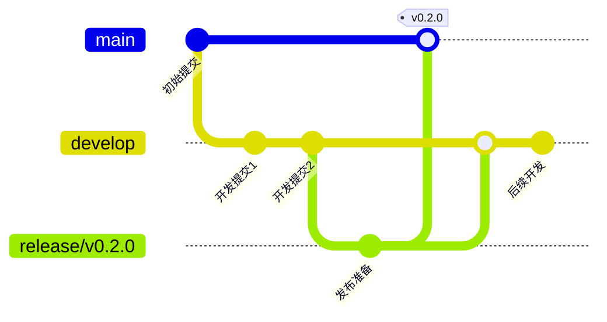

# 版本发布指南

[English](release.md) | [中文](release.zh.md)

## 发布流程

### 1. 发布准备

#### 检查清单

- [ ] 所有功能开发完成并通过测试
- [ ] 文档已更新并审查完毕
- [ ] CHANGELOG.md已更新
- [ ] 版本号已更新
- [ ] 所有CI/CD检查通过
- [ ] 发布说明已准备

#### 版本号管理

遵循[语义化版本控制](https://semver.org/lang/zh-CN/)规范：

- **主版本号**: 不兼容的API修改
- **次版本号**: 向后兼容的功能性新增
- **修订号**: 向后兼容的问题修正

### 2. 发布分支

```bash
# 创建发布分支
git checkout -b release/v0.2.0 develop

# 更新版本号
echo "0.2.0" > VERSION

# 更新CHANGELOG
# 编辑docs/changelog/CHANGELOG-v0.2.0.md

# 提交更改
git add .
git commit -m "chore: prepare release v0.2.0"
```

### 3. 最终测试

```bash
# 运行所有测试
make test
make integration-test

# 构建所有平台二进制文件
make build-all

# 验证二进制文件
./bin/abc-runner-*
```

### 4. 合并到主分支

```bash
# 切换到主分支
git checkout main

# 合并发布分支
git merge release/v0.2.0

# 创建标签
git tag -a v0.2.0 -m "Release version 0.2.0"

# 推送更改
git push origin main
git push origin v0.2.0
```

### 5. 发布到GitHub

#### 创建GitHub Release

1. 访问GitHub Releases页面
2. 点击"Draft a new release"
3. 选择标签版本
4. 填写发布标题和说明
5. 上传预编译二进制文件
6. 发布Release

#### 上传资产

```bash
# 上传预编译二进制文件
gh release create v0.2.0 \
  bin/abc-runner-darwin-amd64 \
  bin/abc-runner-darwin-arm64 \
  bin/abc-runner-linux-amd64 \
  bin/abc-runner-linux-arm64 \
  bin/abc-runner-windows-amd64.exe \
  --title "v0.2.0" \
  --notes "Release notes for v0.2.0"
```

### 6. 发布Docker镜像

```bash
# 构建Docker镜像
docker build -t abc-runner/abc-runner:v0.2.0 .

# 推送镜像
docker push abc-runner/abc-runner:v0.2.0
docker tag abc-runner/abc-runner:v0.2.0 abc-runner/abc-runner:latest
docker push abc-runner/abc-runner:latest
```

### 7. 更新文档网站

```bash
# 构建文档
make docs

# 部署到GitHub Pages
# 或其他文档托管服务
```

### 8. 通知社区

- 发送邮件到邮件列表
- 在社交媒体发布更新
- 更新项目网站
- 通知重要用户

## 版本分支策略

### GitFlow工作流



### 分支命名规范

- **main**: 稳定版本分支
- **develop**: 开发分支
- **feature/***: 功能开发分支
- **hotfix/***: 紧急修复分支
- **release/***: 发布准备分支

## CHANGELOG管理

### 格式规范

```markdown
## [版本号] - 发布日期

### 🚀 新增

- 新功能描述

### 🛠️ 改进

- 改进内容描述

### 🐛 修复

- 修复的问题描述

### 💥 破坏性变更

- 破坏性变更描述

### 🔒 安全

- 安全相关更新
```

### 自动生成

使用工具自动生成CHANGELOG：

```bash
# 使用github-changelog-generator
github_changelog_generator \
  --user your-org \
  --project abc-runner \
  --token $GITHUB_TOKEN \
  --since-tag v0.1.0 \
  --future-release v0.2.0
```

## 质量保证

### 1. 测试覆盖

确保发布前测试覆盖率达到要求：

- 单元测试覆盖率: ≥ 80%
- 集成测试通过率: 100%
- 性能测试基准: 符合预期

### 2. 代码审查

所有代码在合并前必须通过审查：

- 至少一个核心维护者审查
- 所有审查意见必须解决
- 审查通过后才能合并

### 3. 安全检查

```bash
# 运行安全扫描
gosec ./...

# 检查依赖安全
govulncheck ./...
```

## 发布后任务

### 1. 监控

- 监控GitHub Issues
- 监控社区反馈
- 监控下载和使用情况

### 2. 支持

- 及时响应用户问题
- 修复发现的问题
- 更新文档和示例

### 3. 规划

- 收集用户需求
- 规划下一个版本
- 更新路线图

## 紧急修复

### Hotfix流程

```bash
# 从主分支创建hotfix分支
git checkout -b hotfix/critical-bug main

# 修复问题并提交
git commit -am "fix: critical bug fix"

# 合并到主分支并打标签
git checkout main
git merge hotfix/critical-bug
git tag -a v0.2.1 -m "Hotfix release v0.2.1"

# 合并到develop分支
git checkout develop
git merge hotfix/critical-bug

# 删除hotfix分支
git branch -d hotfix/critical-bug
```

### 发布紧急修复

```bash
# 构建并发布紧急修复版本
make build-all
gh release create v0.2.1 \
  bin/abc-runner-* \
  --title "v0.2.1" \
  --notes "紧急修复版本"
```

## 自动化发布

### GitHub Actions

```yaml
# .github/workflows/release.yml
name: Release
on:
  push:
    tags:
      - 'v*'
jobs:
  release:
    runs-on: ubuntu-latest
    steps:
    - uses: actions/checkout@v3
    - name: Setup Go
      uses: actions/setup-go@v4
      with:
        go-version: 1.25.x
    - name: Build binaries
      run: make build-all
    - name: Create Release
      uses: softprops/action-gh-release@v1
      with:
        files: bin/abc-runner-*
        body_path: CHANGELOG.md
      env:
        GITHUB_TOKEN: ${{ secrets.GITHUB_TOKEN }}
```

### Docker自动构建

```yaml
# .github/workflows/docker.yml
name: Docker
on:
  push:
    tags:
      - 'v*'
jobs:
  docker:
    runs-on: ubuntu-latest
    steps:
    - uses: actions/checkout@v3
    - name: Set up Docker Buildx
      uses: docker/setup-buildx-action@v2
    - name: Login to DockerHub
      uses: docker/login-action@v2
      with:
        username: ${{ secrets.DOCKER_USERNAME }}
        password: ${{ secrets.DOCKER_PASSWORD }}
    - name: Build and push
      uses: docker/build-push-action@v4
      with:
        context: .
        push: true
        tags: abc-runner/abc-runner:${{ github.ref_name }},abc-runner/abc-runner:latest
```

## 发布检查清单

### 预发布检查

- [ ] 代码已完成并通过所有测试
- [ ] 文档已更新并审查完毕
- [ ] CHANGELOG已更新
- [ ] 版本号已更新
- [ ] 所有CI/CD检查通过
- [ ] 发布说明已准备
- [ ] 预编译二进制文件已构建
- [ ] Docker镜像已构建

### 发布检查

- [ ] 代码已合并到主分支
- [ ] Git标签已创建并推送
- [ ] GitHub Release已创建
- [ ] 二进制文件已上传
- [ ] Docker镜像已推送
- [ ] 文档网站已更新
- [ ] 社区已通知

### 发布后检查

- [ ] 用户反馈监控已设置
- [ ] 下载统计监控已设置
- [ ] 问题跟踪已准备
- [ ] 下一版本规划已开始

## 常见问题

### 1. 发布失败怎么办？

1. 确定失败原因
2. 修复问题
3. 重新打标签（如果需要）
4. 重新执行发布流程

### 2. 如何回滚发布？

1. 删除GitHub Release
2. 删除Git标签
3. 通知用户
4. 修复问题后重新发布

### 3. 如何处理紧急安全问题？

1. 立即创建hotfix分支
2. 修复安全问题
3. 快速审查和测试
4. 立即发布紧急修复版本
5. 通知受影响用户