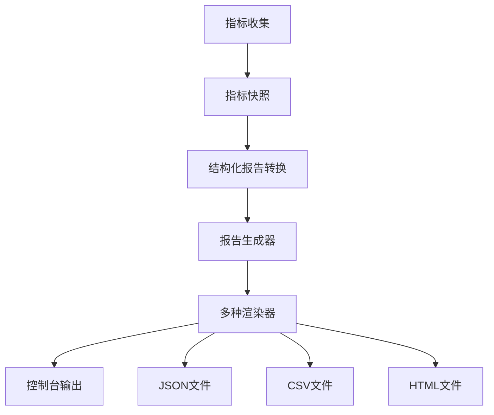

# 性能测试报告系统指南

[English](../en/user-guide/reporting.md) | [中文](reporting.md)

## 概述

abc-runner 报告系统提供全面的性能分析和可视化功能。它将原始指标数据转换为多种格式的结构化报告，深入洞察系统性能、瓶颈和优化机会。

## 报告架构

### 核心组件



### 报告结构

每个性能报告包含四个主要部分：

1. **执行仪表板** - 高级性能摘要
2. **指标分解** - 详细性能分析
3. **系统健康** - 资源利用率和运行时指标
4. **上下文元数据** - 测试配置和环境信息

## 报告格式

### 1. 控制台输出

实时控制台报告，具有格式化输出和视觉指示器。

**特性：**
- 颜色编码状态指示器
- 性能评分可视化
- 关键指标摘要  
- 可执行的洞察和建议

**示例：**
```bash
# 基本控制台报告（默认）
./abc-runner redis -h localhost -p 6379 -n 10000 -c 50

# 带扩展指标的控制台报告
./abc-runner http --url http://api.example.com -n 5000 -c 25 --verbose
```

**控制台输出示例：**
```
================================================================================
             ABC-RUNNER 性能测试报告
================================================================================

📊 执行摘要
----------------------------------------
性能评分: 87/100
系统状态: 🟢 良好
协议类型: redis
测试时长: 30.5s

⚡ 核心性能指标
----------------------------------------
总操作数: 10000
成功操作: 9987 (99.87%)
失败操作: 13 (0.13%)
吞吐量: 327.87 ops/sec

🚀 延迟分析
----------------------------------------
平均延迟: 2.45ms
最小延迟: 0.12ms
最大延迟: 45.67ms
延迟百分位:
  P50: 1.89ms
  P90: 4.23ms
  P95: 6.78ms
  P99: 12.34ms

💻 系统健康状态
----------------------------------------
内存使用: 2.34%
活跃协程: 52
GC次数: 15

💡 关键洞察
----------------------------------------
• 高吞吐量性能: 系统展现出优秀的吞吐量表现
• 延迟稳定性: P99延迟保持在可接受范围内

🔧 优化建议
----------------------------------------
• [HIGH] Connection Pool: 增加连接池大小以提升并发能力
• [MEDIUM] Memory Management: 优化内存分配模式
```

### 2. JSON 报告

机器可读的结构化数据格式，适合集成和进一步分析。

**特性：**
- 完整的指标数据保存
- API 集成友好
- 支持程序化处理
- 时间序列分析兼容

**配置：**
```yaml
reports:
  enabled: true
  formats: ["json"]
  output_dir: "./reports"
  file_prefix: "benchmark"
  include_timestamp: true
```

**生成 JSON 报告：**
```bash
# 单协议 JSON 报告
./abc-runner redis --config config/redis.yaml --output-format json

# 多协议 JSON 报告
./abc-runner http --url http://api.example.com -n 1000 --output-format json,console

# 自定义输出目录的 JSON 报告
./abc-runner kafka --broker localhost:9092 --topic test \
  --output-format json \
  --output-dir ./custom_reports \
  --file-prefix kafka_performance
```

**JSON 结构示例：**
```json
{
  "dashboard": {
    "performance_score": 87,
    "status_indicator": "good",
    "key_insights": [
      {
        "type": "performance",
        "title": "高吞吐量性能",
        "description": "系统展现出优秀的吞吐量表现",
        "impact": "high"
      }
    ],
    "recommendations": [
      {
        "category": "Connection Pool",
        "action": "增加连接池大小以提升并发能力",
        "priority": "high"
      }
    ]
  },
  "metrics": {
    "core_operations": {
      "total_operations": 10000,
      "successful_ops": 9987,
      "failed_ops": 13,
      "success_rate": 99.87,
      "error_rate": 0.13,
      "operations_per_second": 327.87
    },
    "latency_analysis": {
      "average_latency": "2.45ms",
      "percentiles": {
        "p50": "1.89ms",
        "p90": "4.23ms",
        "p95": "6.78ms",
        "p99": "12.34ms"
      }
    }
  }
}
```

### 3. CSV 报告

表格数据格式，非常适合电子表格分析和数据可视化工具。

**特性：**
- Excel/Google Sheets 兼容
- 时间序列趋势分析
- 统计处理
- 数据库导入支持

**生成 CSV 报告：**
```bash
# 基本 CSV 报告
./abc-runner websocket --url ws://localhost:8080/ws -n 1000 --output-format csv

# 自定义字段的 CSV 报告
./abc-runner tcp --host localhost --port 8080 -n 2000 \
  --output-format csv \
  --csv-fields timestamp,protocol,rps,avg_latency,p99_latency

# 多个测试的批量 CSV 生成
for protocol in redis http kafka; do
  ./abc-runner $protocol --config config/${protocol}.yaml \
    --output-format csv \
    --file-prefix ${protocol}_batch_$(date +%Y%m%d)
done
```

**CSV 字段：**
- `timestamp` - 测试执行时间
- `protocol` - 协议类型（redis、http、kafka等）
- `performance_score` - 整体性能评分（0-100）
- `status` - 系统状态（good、warning、critical）
- `total_ops` - 执行的总操作数
- `success_rate` - 操作成功百分比
- `rps` - 每秒请求/操作数
- `avg_latency_ms` - 平均延迟（毫秒）
- `p90_latency_ms` - 90th 百分位延迟
- `p95_latency_ms` - 95th 百分位延迟
- `p99_latency_ms` - 99th 百分位延迟
- `memory_usage_percent` - 内存利用率百分比
- `active_goroutines` - 活跃协程数

### 4. HTML 报告

丰富的可视化报告，具有交互元素和专业呈现。

**特性：**
- 专业视觉设计
- 颜色编码状态指示器
- 响应式布局
- 可打印格式
- 文档嵌入就绪

**生成 HTML 报告：**
```bash
# 基本 HTML 报告
./abc-runner grpc --target localhost:9090 -n 1000 --output-format html

# 自定义样式的 HTML 报告
./abc-runner udp --host localhost --port 8080 -n 500 \
  --output-format html \
  --html-theme professional \
  --include-charts

# 包含所有部分的综合 HTML 报告
./abc-runner redis -h localhost -p 6379 -n 10000 -c 100 \
  --output-format html \
  --html-sections dashboard,metrics,system,insights,recommendations
```

**HTML 报告特性：**
- 执行仪表板和关键指标
- 交互式性能图表
- 详细延迟分析图
- 系统健康指示器
- 可执行建议
- 移动响应式设计

## 报告配置

### 全局配置

在主配置文件中配置报告行为：

```yaml
# config/core.yaml
reporting:
  # 启用/禁用报告系统
  enabled: true
  
  # 默认输出格式
  formats: ["console", "json", "csv", "html"]
  
  # 文件报告输出目录
  output_dir: "./reports"
  
  # 文件命名配置
  file_prefix: "performance"
  include_timestamp: true
  
  # 报告内容配置
  include_system_metrics: true
  include_insights: true
  include_recommendations: true
  
  # 性能阈值
  thresholds:
    error_rate_warning: 5.0    # 5% 错误率警告
    error_rate_critical: 10.0  # 10% 错误率严重
    latency_warning_ms: 500    # 500ms 延迟警告
    latency_critical_ms: 1000  # 1000ms 延迟严重
```

### 协议特定配置

每个协议可以有自定义的报告设置：

```yaml
# config/redis.yaml
reporting:
  formats: ["console", "json"]
  file_prefix: "redis_benchmark"
  
  # Redis 特定指标
  include_redis_info: true
  include_memory_analysis: true
  include_slowlog: true

# config/http.yaml  
reporting:
  formats: ["console", "html"]
  file_prefix: "http_loadtest"
  
  # HTTP 特定指标
  include_response_codes: true
  include_header_analysis: true
  include_body_size_stats: true

# config/kafka.yaml
reporting:
  formats: ["console", "csv"]
  file_prefix: "kafka_performance"
  
  # Kafka 特定指标
  include_partition_metrics: true
  include_consumer_lag: true
  include_broker_stats: true
```

### 命令行配置

直接从命令行覆盖配置设置：

```bash
# 覆盖输出格式
./abc-runner redis -h localhost -p 6379 -n 1000 \
  --report-formats console,json,html

# 自定义输出目录
./abc-runner http --url http://api.example.com -n 2000 \
  --report-dir ./custom_reports \
  --report-prefix api_test

# 禁用特定报告部分
./abc-runner websocket --url ws://localhost:8080/ws -n 1000 \
  --no-insights \
  --no-recommendations \
  --minimal-report

# 配置性能阈值
./abc-runner tcp --host localhost --port 8080 -n 1000 \
  --error-threshold 2.0 \
  --latency-threshold 100 \
  --memory-threshold 80
```

## 高级报告功能

### 1. 性能评分

系统基于以下因素计算综合性能评分（0-100）：

- **成功率（40%）** - 操作成功百分比
- **延迟性能（30%）** - 响应时间指标
- **吞吐量性能（30%）** - 每秒操作数

**评分算法：**
```
基础分数 = 成功率 * 0.4

延迟奖励:
- < 10ms: +30 分
- < 50ms: +20 分  
- < 100ms: +10 分

吞吐量奖励:
- > 1000 ops/sec: +30 分
- > 500 ops/sec: +20 分
- > 100 ops/sec: +10 分

最终分数 = min(基础分数 + 奖励, 100)
```

### 2. 状态指示器

三级状态系统：

- **🟢 良好** - 错误率 < 5%，平均延迟 < 500ms
- **🟡 警告** - 错误率 5-10%，平均延迟 500-1000ms  
- **🔴 严重** - 错误率 > 10%，平均延迟 > 1000ms

### 3. 关键洞察生成

基于性能模式的自动洞察：

**性能洞察：**
- 高吞吐量性能检测
- 延迟稳定性分析
- 错误模式识别
- 资源利用率评估

**可靠性洞察：**
- 连接稳定性分析
- 错误率趋势识别
- 超时模式检测

**效率洞察：**
- 资源优化机会
- 可扩展性瓶颈识别
- 配置调优建议

### 4. 优化建议

带优先级的可执行建议：

**优先级：**
- **HIGH** - 关键性能影响
- **MEDIUM** - 中等性能改进
- **LOW** - 轻微优化机会

**建议类别：**
- 连接池管理
- 内存优化
- 配置调优
- 监控设置
- 基础设施扩展

## 报告集成

### 1. CI/CD 集成

将报告集成到持续集成管道中：

```bash
#!/bin/bash
# ci/performance-test.sh

# 使用 JSON 输出运行性能测试
./abc-runner redis --config ci/redis-test.yaml \
  --output-format json \
  --output-dir ./test-results \
  --file-prefix ci-redis-$(date +%Y%m%d-%H%M%S)

# 解析结果，如果性能下降则失败
python ci/parse-performance.py ./test-results/ci-redis-*.json

# 上传报告到工件存储
aws s3 cp ./test-results/ s3://performance-reports/$(date +%Y/%m/%d)/ --recursive
```

### 2. 监控集成

发送指标到监控系统：

```bash
# 发送指标到 Prometheus pushgateway
./abc-runner kafka --broker localhost:9092 --topic perf-test -n 10000 \
  --prometheus-gateway http://pushgateway:9091 \
  --job-name kafka-performance

# 导出到 InfluxDB
./abc-runner http --url http://api.example.com -n 5000 \
  --influxdb-url http://influxdb:8086 \
  --influxdb-database performance \
  --influxdb-measurement http_test
```

### 3. 仪表板集成

创建性能仪表板：

```javascript
// Grafana 仪表板查询示例
SELECT 
  mean("rps") as "Average RPS",
  mean("p99_latency_ms") as "P99 Latency",
  mean("error_rate") as "Error Rate"
FROM "http_test" 
WHERE time >= now() - 24h 
GROUP BY time(1h)
```

## 报告分析示例

### 1. 性能趋势分析

```bash
# 生成每日性能报告
for day in {1..7}; do
  date_suffix=$(date -d "$day days ago" +%Y%m%d)
  ./abc-runner redis -h localhost -p 6379 -n 10000 \
    --output-format csv \
    --file-prefix daily_redis_$date_suffix
done

# 分析趋势
python analysis/trend_analysis.py ./reports/daily_redis_*.csv
```

### 2. A/B 性能测试

```bash
# 测试配置 A
./abc-runner http --url http://api-v1.example.com -n 5000 \
  --output-format json \
  --file-prefix config_a_test

# 测试配置 B  
./abc-runner http --url http://api-v2.example.com -n 5000 \
  --output-format json \
  --file-prefix config_b_test

# 比较结果
python analysis/ab_compare.py config_a_test.json config_b_test.json
```

### 3. 负载配置文件分析

```bash
# 轻负载测试
./abc-runner websocket --url ws://localhost:8080/ws -n 1000 -c 10 \
  --output-format csv --file-prefix light_load

# 中等负载测试
./abc-runner websocket --url ws://localhost:8080/ws -n 5000 -c 50 \
  --output-format csv --file-prefix medium_load

# 重负载测试
./abc-runner websocket --url ws://localhost:8080/ws -n 10000 -c 100 \
  --output-format csv --file-prefix heavy_load

# 分析负载配置文件
python analysis/load_profile.py light_load.csv medium_load.csv heavy_load.csv
```

## 自定义报告开发

### 1. 自定义渲染器实现

创建自定义报告格式：

```go
// custom_renderer.go
package reporting

import (
    "bytes"
    "fmt"
)

type XMLRenderer struct{}

func NewXMLRenderer() *XMLRenderer {
    return &XMLRenderer{}
}

func (x *XMLRenderer) Format() string {
    return "xml"
}

func (x *XMLRenderer) Extension() string {
    return "xml"
}

func (x *XMLRenderer) Render(report *StructuredReport) ([]byte, error) {
    var buf bytes.Buffer
    
    buf.WriteString("<?xml version=\"1.0\" encoding=\"UTF-8\"?>\n")
    buf.WriteString("<performance_report>\n")
    buf.WriteString(fmt.Sprintf("  <score>%d</score>\n", report.Dashboard.PerformanceScore))
    buf.WriteString(fmt.Sprintf("  <status>%s</status>\n", report.Dashboard.StatusIndicator))
    // ... 更多 XML 生成
    buf.WriteString("</performance_report>\n")
    
    return buf.Bytes(), nil
}
```

### 2. 注册自定义渲染器

```go
// 注册自定义渲染器
generator := reporting.NewReportGenerator(config)
generator.RegisterRenderer("xml", NewXMLRenderer())
```

## 故障排除

### 常见问题

1. **报告生成失败**
   ```bash
   # 检查输出目录权限
   mkdir -p ./reports
   chmod 755 ./reports
   
   # 验证磁盘空间
   df -h ./reports
   ```

2. **缺少指标数据**
   ```bash
   # 启用详细日志
   ./abc-runner redis -h localhost -p 6379 -n 1000 --debug --verbose
   
   # 检查指标收集
   ./abc-runner redis -h localhost -p 6379 -n 1000 --show-metrics
   ```

3. **HTML 报告显示问题**
   ```bash
   # 检查 HTML 模板语法
   ./abc-runner http --url http://example.com -n 100 \
     --output-format html \
     --validate-html
   ```

### 性能优化

1. **大报告文件**
   ```yaml
   reporting:
     # 减少报告大小
     include_raw_metrics: false
     compress_output: true
     max_insights: 5
     max_recommendations: 10
   ```

2. **报告生成速度**
   ```bash
   # 禁用昂贵的报告部分以进行快速测试
   ./abc-runner redis -h localhost -p 6379 -n 1000 \
     --quick-report \
     --no-html \
     --no-insights
   ```

## 最佳实践

1. **报告存储组织**
   ```bash
   # 按日期和协议组织
   reports/
   ├── 2025/01/02/
   │   ├── redis_performance_20250102_143022.json
   │   ├── http_loadtest_20250102_144532.html
   │   └── kafka_performance_20250102_150142.csv
   ```

2. **自动报告清理**
   ```bash
   # 清理旧报告（超过 30 天）
   find ./reports -name "*.json" -mtime +30 -delete
   find ./reports -name "*.csv" -mtime +30 -delete
   find ./reports -name "*.html" -mtime +30 -delete
   ```

3. **报告验证**
   ```bash
   # 验证报告结构
   ./abc-runner redis -h localhost -p 6379 -n 1000 \
     --validate-reports \
     --output-format json
   
   # 检查 JSON 有效性
   cat reports/redis_performance_*.json | jq '.'
   ```

4. **性能基线建立**
   ```bash
   # 创建基线报告
   ./abc-runner redis -h localhost -p 6379 -n 10000 -c 50 \
     --output-format json \
     --file-prefix baseline_redis \
     --baseline-mode
   
   # 与基线比较
   ./abc-runner redis -h localhost -p 6379 -n 10000 -c 50 \
     --output-format json \
     --compare-baseline ./reports/baseline_redis.json
   ```

## 示例

请参阅 [配置示例](../../config/examples/) 目录获取完整的报告配置示例，以及 [脚本](../../scripts/) 目录获取报告分析工具。